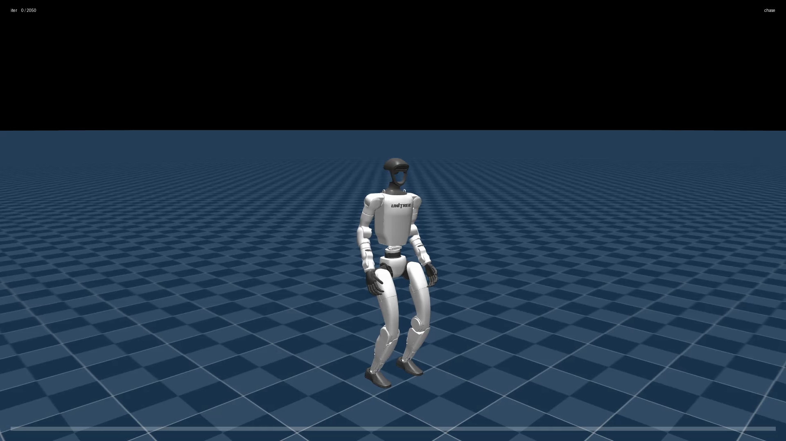
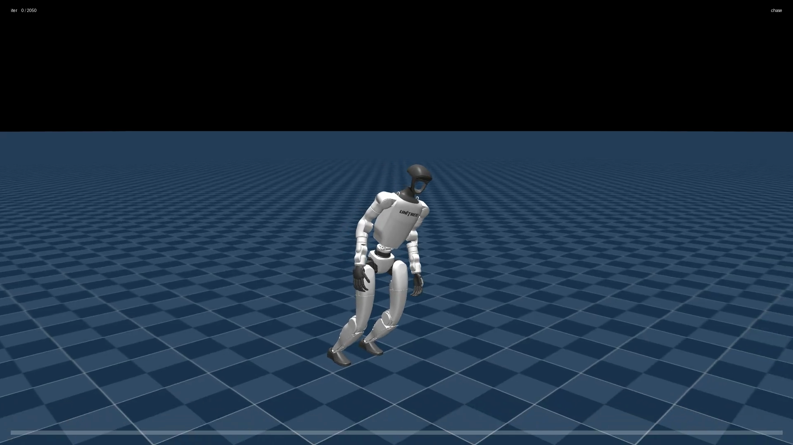
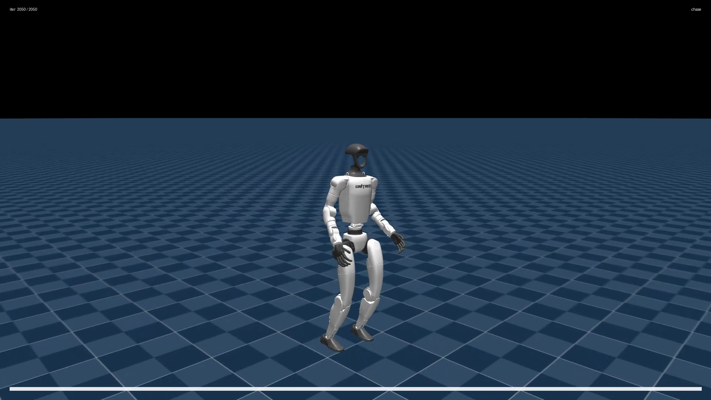

# Watching It Learn: From Random Twitching to Walking

*This is report 01 of four. If any of the terms below — policy, reward, episode, PPO — are new to you, read [00-primer.md](00-primer.md) first; every term is defined there.*

---

## What you are about to see

The baseline training run covered in this series ran for **2,050 iterations**, saving a snapshot of the [policy](00-primer.md) every 50 iterations — 42 snapshots in total. Playing those snapshots back in order is like a time-lapse of learning. Three moments tell the story.

---

### Iteration 0 — random twitching



At iteration 0 the [policy's](00-primer.md) weights have never been adjusted. They are random numbers, so every joint target the network outputs is also essentially random. The robot does not walk. It does not stand. It collapses immediately and twitches — motors firing in no coordinated pattern — and the [episode](00-primer.md) ends in less than a second of simulated time. This is the starting line.

---

### Mid-training — discovering a gait



Somewhere between iteration 500 and iteration 1,000, something clicks. The robot discovers that keeping its center of mass over its feet prevents the [termination](00-primer.md) that cuts an episode short, and that stepping in the commanded direction earns [reward](00-primer.md). The result looks awkward — hunched, stiff, with jerky arm swings — but it is unmistakably forward motion. The robot is staying upright for seconds at a time rather than fractions of a second.

---

### Iteration 2,050 — a confident walker



By the end of the run the gait has smoothed out considerably. The robot tracks a commanded forward speed, keeps its torso upright, and coordinates its legs in a rhythm that looks genuinely human-like. The mean [reward](00-primer.md) at this point is **50.5** (there's no fixed maximum — higher reward is always better), and the robot is surviving almost the entire 20-simulated-second episode. (The run was stopped here; the reward was still climbing, not plateaued — more on that below.)

---

## Reading the reward curve


The plot above shows mean [reward](00-primer.md) on the vertical axis against training iteration on the horizontal axis. The shape is a classic **S-curve** with three recognizable phases.

### Phase 1 — the flat floor (iterations 0–500)

For the first ~500 iterations the reward hovers near zero — just **3.3** at iteration 500. The policy is still producing near-random joint angles. Almost every [episode](00-primer.md) ends in a [termination](00-primer.md): the robot falls almost immediately, so it earns almost no reward before the attempt resets. [PPO](00-primer.md) is adjusting the weights at each iteration, but the adjustments are tiny, and there is so much noise in random-failure episodes that it takes hundreds of tries before any pattern starts to stick.

Think of it like a toddler who has never used their legs. The first hundreds of attempts produce no useful signal about *how* to walk — just the consistent message that falling is bad.

### Phase 2 — the "aha" climb (iterations 500–1,000)

Around iteration 500 the reward begins rising sharply. By iteration 900 it has reached **21.3** — roughly six times the iteration-500 value. This is the moment the policy crosses a threshold: it has learned just enough about balancing to stay upright long enough to start earning the forward-motion reward too.

Once that threshold is crossed, the learning signal becomes much richer. Longer episodes mean more timesteps of reward data per iteration, which means [PPO](00-primer.md) gets clearer feedback about which weight adjustments actually help. The curve steepens.

### Phase 3 — steady refinement (iterations 1,000–2,050)

The curve's slope gradually flattens after iteration 1,000 but never stops rising. At iteration 1,400 the reward is **31.5**; at iteration 2,050 it reaches **50.5**. The robot is no longer discovering the basic concept of walking — it is refining posture, arm swing, step timing, and energy efficiency. Each of those improvements earns a small additional reward, but no single improvement produces a dramatic jump like the "aha" did.

The run ended here without plateauing. Given more iterations, the curve would likely have continued rising, though with diminishing returns.

---

## Episode length: the same story, told differently


[Episode length](00-primer.md) — how many timesteps the robot survives before falling or timing out — is plotted above over the same run. Episode length tracks the reward curve through the first half of training, then flattens out: once the robot can stay upright for nearly the whole episode, it hits the 1,000-step ceiling and can't go higher, even as reward keeps climbing.

| Iteration | Mean reward | Mean episode length (max 1,000 steps) |
|-----------|-------------|---------------------------------------|
| 500       | 3.3         | 173                                   |
| 900       | 21.3        | 962                                   |
| 1,400     | 31.5        | 925                                   |
| 2,050     | 50.5        | 995                                   |

At iteration 500, episodes are averaging only 173 steps — the robot falls quickly. By iteration 900, episodes are averaging 962 steps — the robot is nearly running out the full 1,000-step clock every time. The two numbers (reward and episode length) track together because they are two faces of the same fact: **staying upright longer both earns more reward and registers as a longer episode**. A robot that falls at step 50 can only collect 50 timesteps of reward. A robot that runs the full episode collects 1,000. So as the policy improves at not-falling, both metrics rise together.

The episode length also explains the shape of the reward curve. Notice that episode length jumps hard between iterations 500 and 900 — from 173 to 962 — while reward only goes from 3.3 to 21.3. Episode length saturates (hits the 1,000-step ceiling) quickly once the robot can walk at all; reward keeps climbing because now the robot has a full episode's worth of time to earn velocity-tracking points, smoothness points, and upright-posture points that it couldn't reach before.

---

## Reproducing the progression video

The three stills above come from a video built by replaying the 42 saved checkpoints in order. To reproduce it, run the following command **inside the `mjlab-dev` container**:

```bash
MUJOCO_GL=egl python -m mjlab.scripts.record_learning_progression \
  Mjlab-Velocity-Flat-Unitree-G1 \
  --run-dir logs/rsl_rl/g1_velocity/2026-04-17_18-46-23 \
  --num-checkpoints 24 \
  --cameras chase,side \
  --command-lin-vel-x 1.0
```

Note: the task ID (`Mjlab-Velocity-Flat-Unitree-G1`) must be supplied explicitly. Both G1 tasks — flat terrain and rough terrain — share the experiment name `g1_velocity`, so the script cannot auto-detect which task produced a given run directory.

---

## Tweak this to explore

The command above has a few parameters worth experimenting with:

**`--command-lin-vel-x <speed>`** — the forward speed (in m/s) the robot is commanded to walk during recording. The value `1.0` produces a brisk walk. Try `0.3` for a slow, cautious pace or `1.5` for a near-jog. The policy's behavior at an unusual speed can reveal whether it has generalized or only learned one specific pace.

**`--num-checkpoints <N>`** — how many of the 42 saved checkpoints to include in the video. The default `24` samples evenly across the run. Use a smaller number (e.g. `8`) for a quick survey, or `42` to include every checkpoint and see the fine-grained progression.

**`--cameras <list>`** — which camera angles to record. `chase` follows the robot from behind; `side` shows a lateral view. You can pass one or both (comma-separated). A side view makes gait asymmetries easier to spot; a chase view makes heading drift obvious.

---

## What's next

- **[02-reproducing-the-benchmark.md](02-reproducing-the-benchmark.md)** — run the same training yourself and compare your learning curves to the baseline.
- **[03-turning-the-knobs.md](03-turning-the-knobs.md)** — change one reward parameter and watch how the gait and curves shift.
