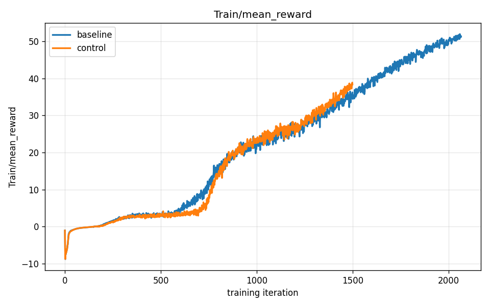
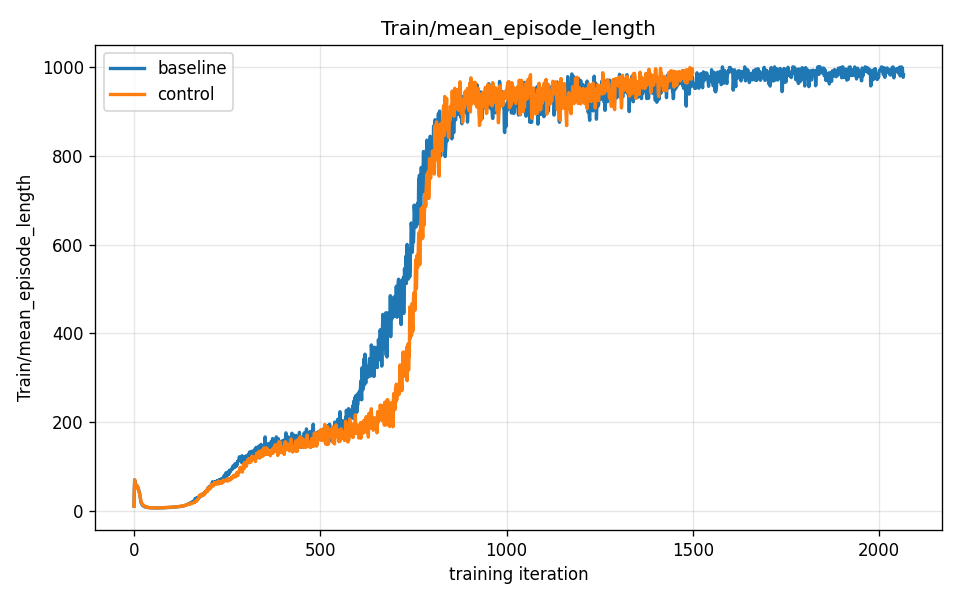
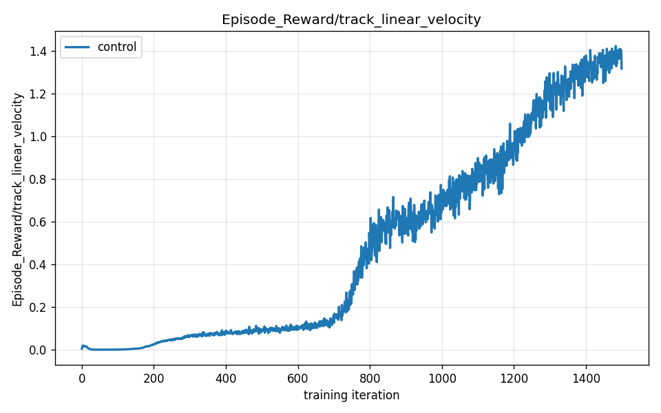
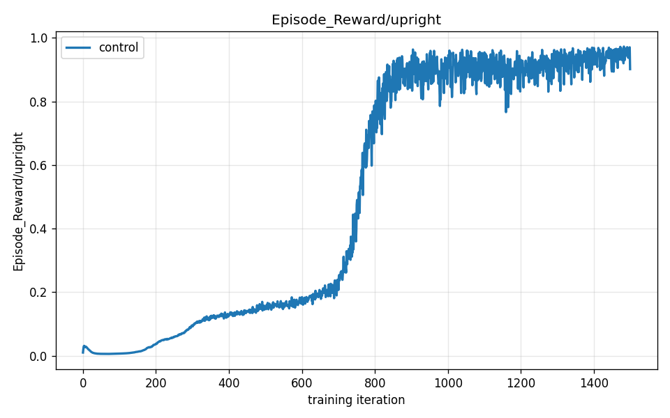
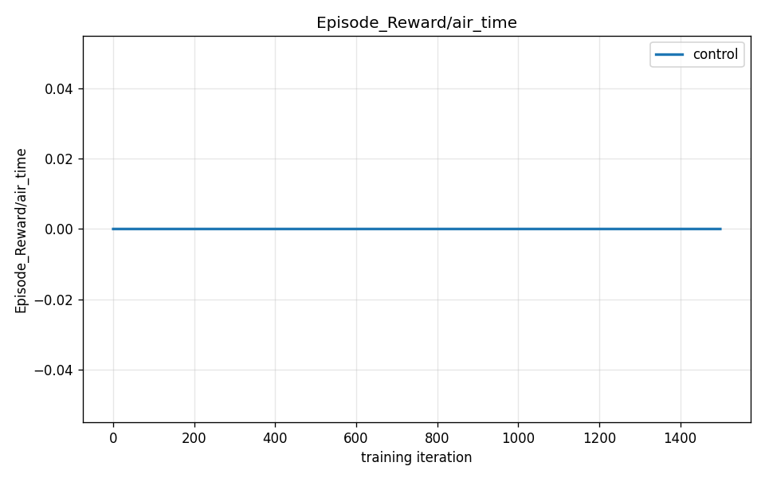
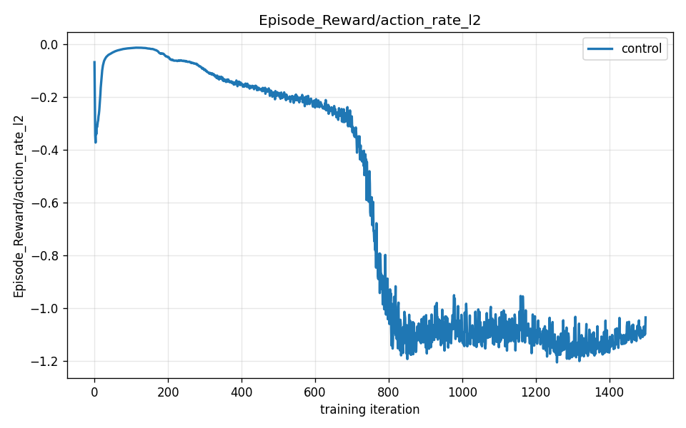

# Reproducing the Benchmark: Running Training from Scratch

*This is report 02 of four. Terms like [policy](00-primer.md), [reward](00-primer.md), [episode](00-primer.md), [PPO](00-primer.md), and [termination](00-primer.md) are defined in [00-primer.md](00-primer.md). Report [01-watching-it-learn.md](01-watching-it-learn.md) covered the original baseline training run that this report replicates.*

---

## Why bother reproducing a result?

A single successful training run is encouraging. Two independent runs that produce the same shape of curve are evidence. Reproducibility — re-running an experiment with the same recipe and getting the same result — is the difference between "we got lucky once" and "this is real."

Training involves randomness at every level: the random starting weights of the [policy](00-primer.md), the random episode resets, and even small non-deterministic arithmetic in the GPU hardware. Any of those could cause a run to succeed or fail for reasons unrelated to the recipe. If the *shape* of the learning curve reproduces across independent runs — same slow start, same sharp climb, same final trajectory — you have strong evidence the algorithm is behaving as intended.

This report re-ran G1 walking training from scratch, then examines exactly what the robot is scored on.

---

## Preparing the machine

The DGX Spark uses **unified memory** — the GPU and CPU share one physical pool of RAM. If that pool runs out, instead of a clean "out of memory" error, the machine starts swapping (shuffling data to slow storage) and can spiral into a hard reboot, losing the training run entirely.

Before starting, we stopped three co-tenant services sharing the box — a chat UI, an AI model server, and a database. During the run we monitored memory live; the workload used roughly 13 GB against ~110 GB available, so swap was never touched. The rule: before any long GPU run on a shared machine, quiesce everything else.

---

## The training command

We trained a fresh [policy](00-primer.md) from scratch with the identical recipe as the original baseline, using the `mjlab-dev` Docker container on the DGX Spark:

```bash
MUJOCO_GL=egl CUDA_VISIBLE_DEVICES=0 \
  python -u -m mjlab.scripts.train Mjlab-Velocity-Flat-Unitree-G1 \
  --env.scene.num-envs 2048 \
  --agent.max-iterations 1500 \
  --agent.run-name arc-control
```

Key flags: `--env.scene.num-envs 2048` runs 2,048 copies of the robot in parallel (more robots = more experience per [PPO](00-primer.md) update); `--agent.max-iterations 1500` stops after 1,500 iterations (the original baseline ran to 2,050 — we ran shorter to confirm reproducibility without duplicating the full cost). We used **seed 42** — the same as the baseline — to keep the intended random choices (weight initialization, episode resets) aligned. We didn't pass a seed flag in the command above; 42 is the framework's default, and both the original baseline and our control run used that default, so the command reproduces the exact same starting randomness. The run took approximately **26 minutes**, about 1 second per iteration, on a single NVIDIA GB10 GPU.

---

## The result: the curves match

The two plots below overlay the original baseline run (blue) and the fresh control run (orange) on the same axes.





The two curves nearly overlap through iteration 1,500. Both start near zero. Both climb sharply between roughly iteration 700 and iteration 900 — the "aha" moment described in [01-watching-it-learn.md](01-watching-it-learn.md), where the robot first learns to stay upright long enough to earn velocity-tracking points. Both flatten into the same refinement phase afterward.

The matched-iteration comparison:

| Iteration | Baseline reward | Control reward | Baseline episode length | Control episode length |
|-----------|----------------|----------------|------------------------|------------------------|
| 500       | 3.3            | 2.9            | 173                    | 162                    |
| 900       | 21.3           | 19.5           | 962                    | 926                    |
| 1,400     | 31.5           | 36.0           | 925                    | 996                    |
| 1,500     | —              | 38.4           | —                      | 988                    |
| 2,050     | 50.5           | —              | 995                    | —                      |

The baseline ran longer (to 2,050 iterations, reaching a final reward of 50.5), which is why it shows the higher eventual number. The control, stopped at 1,500 iterations, reached 38.4 — consistent with the trajectory the baseline was on at that same point.

### A note on the small differences

The numbers are close but not identical. At iteration 1,400, for example, the control (36.0) is slightly *ahead* of the baseline (31.5), before converging again. Don't read too much into which run is momentarily ahead at any single checkpoint — in the refinement phase, run-to-run randomness means either run can edge the other; what matters is that both follow the same curve. These small run-to-run differences are **expected and honest** — they come from GPU nondeterminism (the order in which thousands of floating-point operations are accumulated on the GPU can change subtly between runs, even with the same seed) and from slightly different random episode resets. If the two curves were *perfectly* identical, that would actually be suspicious — it would suggest something was cached or the runs were not truly independent.

What matters for reproducibility is the **shape and ballpark**: the same slow start, the same sharp climb in the same window, the same refinement trajectory. Both runs do this. The result is real.

---

## What is the robot actually being rewarded for?

The total [reward](00-primer.md) is a sum of several individual terms, each scoring a different aspect of behavior. Here are the four most informative ones from the control run.

### Track linear velocity — the main job



This term scores how closely the robot matches the commanded forward speed. It is the single largest contributor to total reward. Early in training it is near zero — the robot can't walk at all — and it rises as the robot learns to move at the commanded pace. If you look at just this one term, it tells almost the entire story of the run.

### Upright — don't tip over



This term scores how vertical the torso is. A perfectly upright torso earns full points; leaning costs points; hitting the ground (a [termination](00-primer.md)) cuts the episode short. The upright term rises quickly and stays high — the robot learns to not tip over relatively early, and maintaining that is a prerequisite for earning any other reward.

### Air time — take real steps



This is a **gait-shaping** reward. It gives a small bonus each time a foot spends a moment fully in the air — a deliberate nudge toward picking feet up and taking genuine steps, rather than shuffling along the ground or sliding. Without a term like this, the policy might discover that dragging its feet forward is a cheap way to move without really lifting them. Air time discourages that. The curve rises as the robot develops a more natural stepping rhythm.

### Action rate — smooth, not jerky



This term is a **penalty**: it subtracts points for motor commands that change rapidly from one timestep to the next. Jerky, rapidly oscillating joint commands are hard on real actuators and produce unstable motion. The penalty pushes the learned policy toward issuing smooth, gradual commands instead. Notice that the curve is **negative** — that is correct for a penalty term. As training progresses, the magnitude decreases (the curve moves toward zero), meaning the robot is producing smoother and smoother commands over time.

There are additional terms — `pose`, `foot_clearance`, `foot_slip`, `soft_landing`, and others — that all contribute to the total reward. The four above are highlighted because they most directly explain why the gait looks the way it does.

---

## How episodes end

An [episode](00-primer.md) ends in one of two ways, as defined in [00-primer.md](00-primer.md):

- **`time_out`** — the robot survived the full ~20 simulated seconds (1,000 steps). This is success.
- **`fell_over`** — the torso touched the ground before the timer expired. The episode is cut short, and the robot earns no more reward for that attempt.

Early in training, nearly every episode ends with `fell_over` — the robot collapses almost immediately and the episodes are very short (recall: 173 steps average at iteration 500). By the end of training, almost every episode ends with `time_out` — the robot runs the full clock. That transition from `fell_over`-dominated to `time_out`-dominated is exactly what drives the episode length curve from 173 to 988.

---

## Tweak this to explore

If you want to experiment with training yourself, three parameters in the command above are the most instructive to change:

**`--agent.max-iterations <N>`** — Running longer generally means a higher final reward, because the refinement phase continues past where we stopped. Our baseline ran 2,050 iterations and reached 50.5; the 1,500-iteration control reached 38.4. The returns are diminishing — each additional 100 iterations gains less than the previous 100 — but training is cheap enough here that running to 2,000 or beyond is reasonable.

**`--agent.seed <N>`** — Changing the random seed produces a new independent run. Comparing two or three seeds directly characterizes run-to-run variance: similar curves mean the algorithm is robust; wide divergence means it is sensitive to initialization.

**`--env.scene.num-envs <N>`** — More parallel environments means more experience per [PPO](00-primer.md) update, which generally means faster learning (fewer iterations to reach the same reward). Try `4096` on a machine with plenty of memory, or `1024` if memory is tight.

---

## What's next

- **[03-turning-the-knobs.md](03-turning-the-knobs.md)** — change one reward parameter and watch how the gait and learning curves shift.

If you haven't yet read the original training run's learning curves, **[01-watching-it-learn.md](01-watching-it-learn.md)** walks through the baseline S-curve phase by phase, alongside video stills of the robot at different stages of training.
