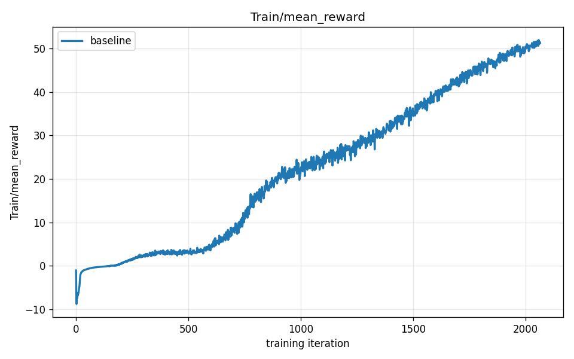
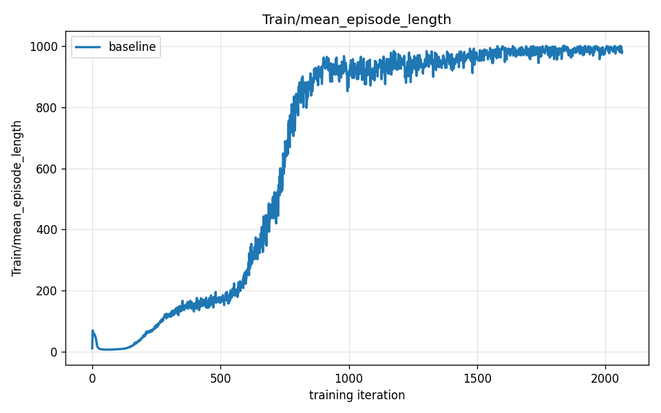

# Chapter 05 — Reading the Training

*Chapter 04 closed with a promise: once you understand PPO — the clipping, the advantage, the on-policy loop — the next step is to look at what it produces and learn to read it. That is this chapter. By the end you will be able to pick up a reward curve you have never seen before and answer three questions: is learning healthy, has it stalled, and — crucially — does the number going up actually mean the robot is doing what you want? That last question carries more weight than it first appears.*

---

## What a training run produces

Every time you launch a training run, PPO generates two numbers at the end of each iteration and logs them. Both are averages across the batch of parallel environments that just finished collecting experience.

**Mean reward** — the average total return earned per episode during the most recent rollout. This is the quantity PPO is trying to make go up. It is the primary signal.

**Mean episode length** — how long each episode ran, in timesteps, before the robot either fell or ran out of time. Longer is generally better: a robot that survives its whole episode earns far more reward than one that crashes at step 50. You did not ask the algorithm to maximize episode length — that is not part of the objective — but it tends to rise alongside reward anyway. More on exactly why in a moment.

Plot both numbers against iteration, and you get the two curves that are the subject of this chapter.

---

## The reward curve

The curve above is from the baseline walking run: a Unitree G1 humanoid learning to match a commanded forward velocity from scratch, trained with PPO inside the `mjlab` framework, 2048 parallel environments, episodes capped at 1000 timesteps. It ran for **2050 iterations**.

The shape is the same shape you will see in almost every successful RL run: a rough **S-curve** with three recognizable phases. Learn these three phases and you can read any reward curve at a glance.

---

### Phase 1 — the flat floor (iterations 0–500)

The curve opens almost flat, hovering near zero. At iteration 500 the mean reward is just **3.3**.

Why so slow? The policy's weights started as random numbers, so every joint target it outputs is essentially random. The robot does not walk. It does not even stand. Episodes end in under a second of simulated time — the robot collapses, the episode resets, another random attempt begins. A robot that falls at step 10 collects reward for only 10 timesteps before the reset. That is almost no signal. PPO is doing its job — computing advantages, clipping, stepping the weights — but when episodes are this short, the feedback coming back from each rollout is overwhelmingly noise.

Think of it like learning to ride a bike with a thick blindfold: every attempt ends in an immediate fall, and you have almost no memory of *what you were doing* at the moment it went wrong. PPO needs enough of an episode to survive to build a useful advantage estimate. Until the robot stays up long enough to see the consequences of its actions, every gradient step is mostly a shrug.

This phase is not failure. It is the price of starting from nothing. The flat floor is always there; the only question is how long it lasts.

---

### Phase 2 — the "aha" climb (iterations 500–1,000)

Around iteration 500 the curve tilts sharply upward. By iteration 900 the reward has reached **21.3** — roughly six times its iteration-500 value.

Something has clicked: the policy has learned just barely enough about not-falling to stay upright long enough to start earning velocity-tracking reward. The first time it survives twenty steps instead of five, PPO gets real signal about which joint patterns are helping. That signal lets it take a better-aimed gradient step. A better step produces a slightly longer episode next time. A longer episode means even more signal. The improvement compounds.

> **Insight: the aha climb is a feedback loop, not a lucky jump.**
> This is the core dynamic of RL from scratch. The first threshold — staying upright long enough to earn any useful signal — is the hardest to cross. Before it, learning is nearly blind. After it, each improvement begets more data, which begets better improvements. The steep slope in Phase 2 is that feedback loop running. It is the S-curve's defining feature, and you will see it in every skill learned from scratch in this series.

This phase ends not because the robot has stopped improving, but because the feedback loop hits a ceiling: a robot that can now survive most of its episode has used up most of the episode-length gains available. The next kind of improvement is different in character.

---

### Phase 3 — steady refinement (iterations 1,000–2,050)

The slope flattens after iteration 1,000 but the curve keeps rising. At iteration 1,400 the reward is **31.5**; at iteration 2,050 it reaches **50.5**. The robot is no longer discovering the concept of walking. It is refining posture, arm swing, step timing, energy efficiency — a dozen smaller improvements, each worth a little more reward, none worth a dramatic jump.

The run ended here. The reward was still climbing, not plateaued — given more iterations, the curve would have continued upward, with diminishing returns. We will look at what a true plateau looks like shortly.

---

## The episode-length curve

The episode-length curve above covers the same run. The shape echoes the reward curve — but then diverges.

| Iteration | Mean reward | Mean episode length (max 1,000 steps) |
|-----------|-------------|---------------------------------------|
| 500       | 3.3         | 173                                   |
| 900       | 21.3        | 962                                   |
| 1,400     | 31.5        | 925                                   |
| 2,050     | 50.5        | 995                                   |

### Why episode length and reward track together early

Both numbers rise steeply between iteration 500 and iteration 900. This is not a coincidence; it is the same fact expressed twice. A robot that falls at step 50 collects reward for exactly 50 timesteps. A robot that runs the full episode collects 1,000 timesteps of reward. **Staying upright longer earns more reward, and the same staying-upright registers as a longer episode.** The two metrics are not measuring independent things during the early climb — they are two angles on one improvement: the robot learning not to fall.

Once the robot can walk at all, episode length approaches its ceiling. By iteration 900, episodes are already averaging 962 steps out of a 1,000-step cap — there is almost no room left to go higher, and the small dip to 925 at iteration 1,400 is within the run-to-run noise you saw in Chapter 07. But reward keeps climbing, because a robot that now survives its whole episode has 1,000 timesteps in which to earn velocity-tracking points, smoothness points, and upright-posture points it could not collect before. Episode length hovers near its ceiling; reward keeps rising as the policy gets better at *what it does with the time it has*.

> **Insight: episode length is a leading indicator, not a goal.**
> Early in training, a rising episode-length curve is the best sign that learning is healthy — it means the robot is staying alive long enough to generate real signal. Once it saturates, stop looking at it as a progress indicator. The real competition is now in the reward curve: how efficiently is the policy using the full episode it now has? The two curves are teammates in Phase 2 and diverge in Phase 3 — which is itself useful information about where in the training arc you are.

---

## What convergence and plateau look like

The baseline run ended before its reward plateaued. But in a longer run, or a harder task, you would eventually see the reward curve flatten and stay flat across hundreds of iterations. That is **convergence**.

Convergence does not mean the policy is perfect. It means the current reward signal, the current network capacity, and the current training setup have collectively reached a ceiling. Every PPO gradient step is producing an advantage near zero — the policy's current behavior is, by the optimizer's lights, roughly as good as the rollout data can make it. There are at least three ways a curve can plateau:

**Genuine skill ceiling.** The task is basically solved, or at least solved to the limit of what the reward terms reward. More training produces diminishing returns with no new behavior emerging. This is the good plateau.

**Local optimum.** The policy has settled into a gait or strategy that earns decent reward but that is not the global best. From here, every small gradient step makes things slightly worse before they could get better — so the optimizer stays put. This is the tricky plateau: not a failure exactly, but not the best outcome either.

**Reward-budget exhaustion.** Every reward term the designer wrote has been more or less maximized. The policy cannot earn more without changing the task itself.

In practice, distinguishing these takes more than looking at the reward curve alone. That is Part IV's job. For now, the pattern recognition matters: **a curve that flattens and stays flat for hundreds of iterations has converged. A curve that is still gently climbing has not yet, and more training may still help.**

---

## The number going up does not prove the behavior is good

This is the most important thing in this chapter.

A reward curve climbing to 50 over 2050 iterations is compelling evidence that *something* improved. The policy went from collapsing immediately to surviving 995 of 1,000 timesteps, earning 50 units of mean return per episode. Those numbers are real. But here is the question you have to hold alongside them: **improved at what, exactly?**

The reward is a proxy. It is not the thing you actually want — a robot walking usefully — it is a *numerical approximation* of that thing, written by a human. And human-written proxies are imperfect. A policy is not trying to do what you *intended*. It is trying to do what the numbers *say*. Sometimes those are the same. Sometimes they are not.

Consider a simple example. Suppose the reward pays for matching a forward speed of 1 m/s. A walking policy that matches the speed cleanly earns high reward. So would a sliding policy that somehow keeps its center of mass moving forward at 1 m/s without using its legs at all — if the physics allowed it. Both would produce the same number on the reward curve. The curve cannot tell them apart. Only looking at the robot's actual behavior can.

The baseline walking policy, it turns out, does walk. The plots in this chapter are honest — the behavior matches the metric. But the series ahead is largely about cases where it does not. Higher reward sometimes produces a subtly wrong gait. Higher reward sometimes produces a wildly wrong strategy that the designer never imagined. The metric climbs; the behavior diverges from intent.

We will build a precise vocabulary for this in later chapters. For now, hold the seed of it: **a number going up is necessary but not sufficient evidence that the robot is doing the right thing. The metric is a tool, not the truth. Always look at the behavior.**

> **Insight: metrics are proxies, and proxies can be gamed.**
> You designed the reward function to approximate what you want. The optimizer found the exact peak of that approximation. Those are not the same thing. The bigger the gap between "what I wrote" and "what I meant," the bigger the potential divergence between a rising metric and a desirable behavior. This gap is something you will learn to spot — and eventually exploit deliberately, by designing rewards more carefully. That is most of Part IV and beyond.

---

## What you now understand

- The **reward curve** is a plot of mean return per episode against training iteration. Its characteristic shape is an S-curve with three phases: a **flat floor** (near-random behavior, short episodes, weak signal), an **"aha" climb** (the feedback loop ignites once the robot learns enough not to fall), and **steady refinement** (incremental improvements over a full episode).
- The **episode-length metric** measures mean episode duration in timesteps. It rises alongside reward in the early phases — because staying upright longer and earning more reward are the same improvement — then saturates once the robot can survive most of its episode. It is a strong leading indicator in Phase 2 and becomes less informative after that.
- **Convergence / plateau** is when the reward curve flattens and stays flat across many iterations. It signals that the current policy, reward, and setup have reached their ceiling together — not necessarily that the task is solved.
- **The metric is not the behavior.** A rising number proves something improved, not that the right thing improved. The reward is a human-written approximation of intent, and the optimizer found its peak. Those two things can diverge — and the rest of this series is, in large part, the story of that divergence.

The baseline walking run produced a clean, honest curve: reward and behavior rose together, the S-shape is unmistakable, and the numbers match what you see when you watch the robot. In Part III you will watch it happen in real time — stills, videos, and the moment the curve's "aha" knee lines up with the first recognizable step. Then you will start changing things and seeing how the curve and the behavior respond to each other.

Continue to [Chapter 06 — Watching It Walk](06-watching-it-walk.md).
