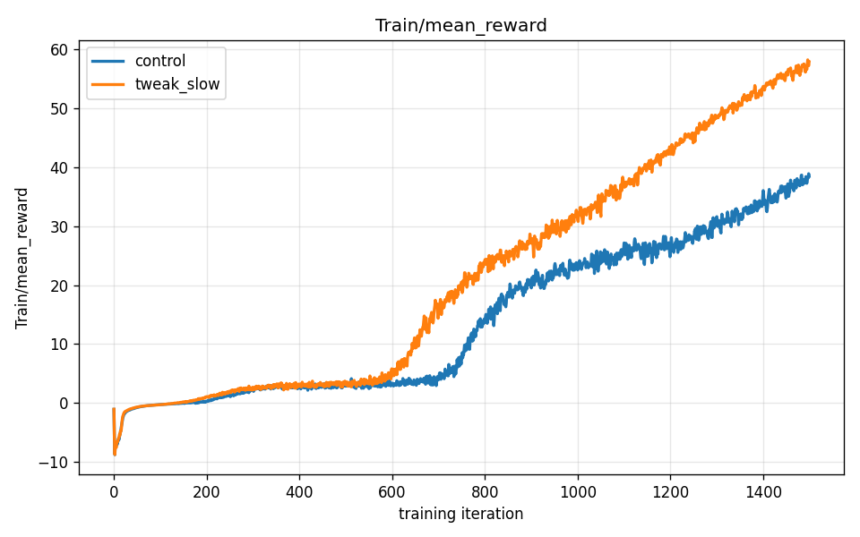
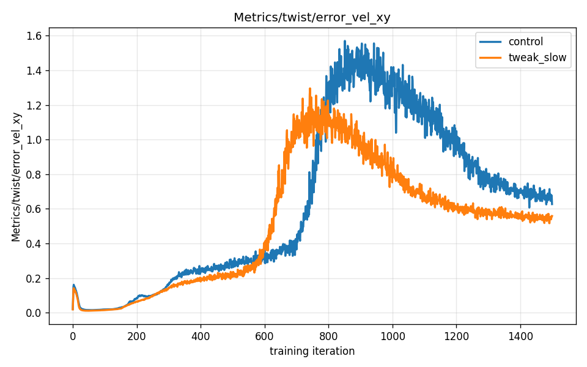
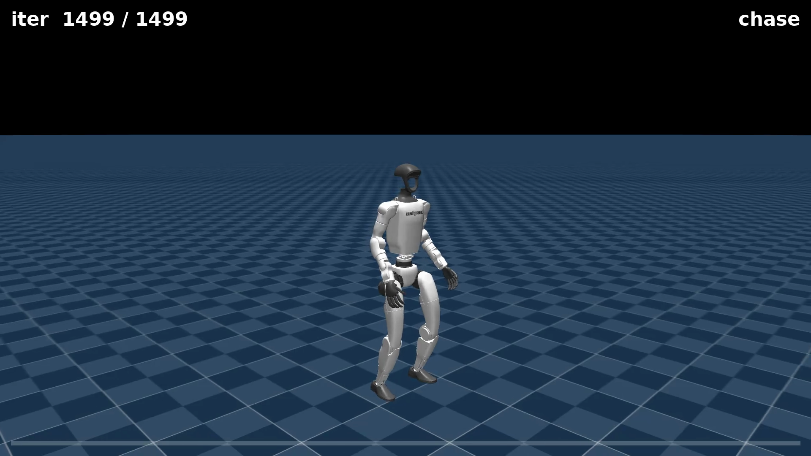
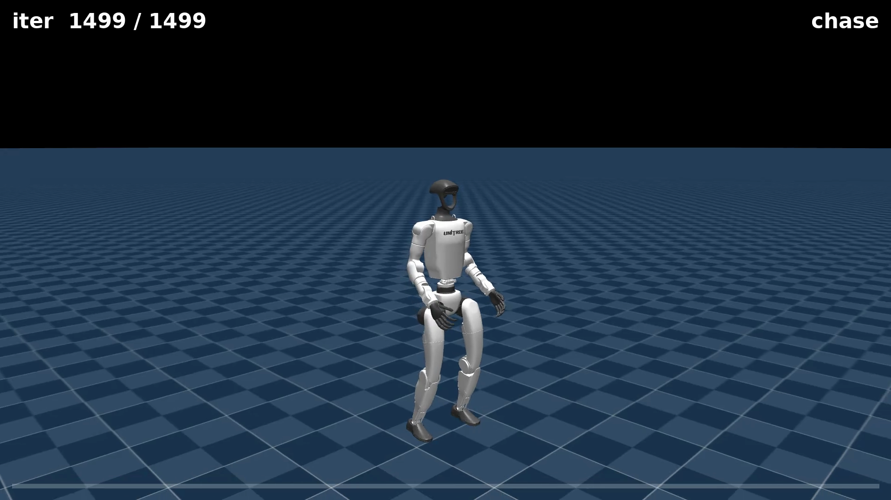

# Chapter 08 — Turning the Knobs

*Chapter 07 ended with two independent training runs producing nearly identical reward curves, proving the baseline walking result is real and not a lucky fluke. Now a harder question: what happens when you deliberately change something? This chapter introduces the discipline of controlled experiments, the single most important idea in RL research, and the single most common mistake people make when reading the numbers.*

---

## Part III closes: from observing to experimenting

The first seven chapters were about understanding the baseline. You watched the robot learn to walk (ch05–06), verified the result was reproducible (ch07), and learned to read the reward curve and the per-term breakdown. Part III closes with the payoff: running your first real experiment. Two policies, one change, two very different robots — and a lesson about what reward numbers actually mean.

---

## The discipline of one change

Science has a simple core rule: if you want to know what causes something, change exactly one thing and hold everything else constant. Call this the **one-change experiment discipline**.

It sounds obvious. In practice, it is extremely easy to violate. RL training involves dozens of tunable parameters — reward weights, network size, number of parallel environments, learning rate, episode length, speed range. If you change three of them at once and the robot improves, you have learned almost nothing: any one of the three changes might be responsible, or none of them, or some interaction between them. You end up with a better number and no understanding of why.

The discipline: pick one variable, clone the rest exactly, run both, and compare. The result may be a modest lesson. But it is an *actual* lesson, not a guess.

---

## The experiment

We trained two policies from scratch with an **identical recipe** — same PPO algorithm, same reward function, same neural-network shape (512 → 256 → 128 hidden layers, ELU activations), same random seed, same 1,500 iterations — and changed exactly one thing: the range of forward speeds the robot practiced.

- **Control** — the standard setup. Commanded forward speed drawn from **−1.0 to +1.0 m/s**. The robot practiced the full range of walking and slow-backing speeds throughout training.
- **Tweak ("slow")** — a restricted setup. Commanded forward speed drawn from only **−0.5 to +0.5 m/s**. The robot only ever practiced slow speeds — never asked to walk faster than half a meter per second.

Everything else: 2,048 parallel simulations, same reward weights, same network, same seed 42.

### An honest aside about "one change"

The flat-terrain velocity task includes a built-in **curriculum** — a scheduled sequence of difficulty stages that automatically ramps the commanded speed range upward as training progresses. The curriculum is a helpful mechanism for teaching the robot progressively harder tasks; Chapter 10 explains it fully. For now, the key thing to understand is that the curriculum is active even on flat terrain.

Because of the curriculum, pinning the tweak to the slow range required more than one flag. The curriculum's first stage fires at every episode boundary and resets the commanded speed range, overwriting a plain command-range override. To hold the speed range at ±0.5 m/s through the entire run, the command range *and* all three curriculum stages had to be overridden explicitly. The complete override pattern looks like this:

```bash
python -m mjlab.scripts.train Mjlab-Velocity-Flat-Unitree-G1 \
  --env.commands.twist.ranges.lin-vel-x="(-0.5, 0.5)" \
  "--env.curriculum.command-vel.params.velocity-stages.0.lin-vel-x=(-0.5, 0.5)" \
  "--env.curriculum.command-vel.params.velocity-stages.1.lin-vel-x=(-0.5, 0.5)" \
  "--env.curriculum.command-vel.params.velocity-stages.2.lin-vel-x=(-0.5, 0.5)"
```

> **Insight — the curriculum-clobber**
>
> The most confusing gotcha in this codebase. Passing only `--env.commands.twist.ranges.lin-vel-x="(-0.5, 0.5)"` looks like it should pin the speed range. It does not. The curriculum's stage-0 callback fires at every episode boundary and silently resets the command range back to its stage values — clobbering your override entirely, with no warning. The only fix is to override the command range *and* all three `velocity-stages.{0,1,2}` entries as shown above.
>
> Two syntax details that trip people up: the tuple value must use `=` rather than a space (so `lin-vel-x=(-0.5, 0.5)` not `lin-vel-x (-0.5, 0.5)`), and the quoted form is needed because parentheses confuse most shells. After a run, always check `params/env.yaml` in the saved log directory to verify the stages actually match what you intended.

The principle of the experiment remains a single intended change — the speed range — even though implementing it correctly required four flags. That is a useful real-world lesson too: "one change" refers to the thing you are testing, not necessarily the number of lines in the command.

---

## Result 1 — the training curves



Both policies improved over 1,500 iterations, producing the familiar S-curve shape from Chapter 05. At the end of training:

| Run | Final mean reward |
|-----|-------------------|
| Control (speed range −1.0 to +1.0 m/s) | 38.4 |
| Tweak (speed range −0.5 to +0.5 m/s) | **57.8** |

The slow-trained policy reached a **higher reward** than the control. If you glance only at that number, the tweak looks like the better training run.

**It is not. This is the most important idea in this chapter:**

> **Higher reward does not mean a better robot. It means the policy did better at the task it was given — and the slow task is simply easier.**

Think of it this way. If you ask a runner to jog 100 meters in under 30 seconds, most people can do it and score full marks. If you ask a sprinter to run 100 meters in under 11 seconds, almost no one can. The jogger "scores higher" on the 30-second test — that does not mean the jogger is faster. The tests are different, so the scores are not comparable.

Here, the tweak's reward is higher because tracking a speed of 0.3 m/s is genuinely easier than tracking a speed of 0.8 m/s. The velocity-tracking reward term is higher when the target is easier to hit. The slow policy scored more points by playing an easier game, not by being a more capable walker. **Reward numbers are only meaningful when compared between runs that share the same task.**



The speed-tracking error plot makes this concrete. The tweak's error is lower throughout training because it only ever chased slow, easy targets. The control's error is higher because it chased the full range — including the fast speeds that are genuinely harder to hit. Lower tracking error is better tracking, but the tweak achieved lower error by being handed an easier job.

---

## Result 2 — what happens when you push both to go fast

A reward number is one window into a policy. To understand what the policy actually *does*, you have to watch it move. We commanded **both** final policies to walk forward at **1.0 m/s** — a brisk walk comfortably within the control's training range, but **double the tweak's training maximum**.

The tweak had never, in its entire 1,500-iteration training history, been asked to go this fast.

**Control policy — commanded to walk at 1.0 m/s:**

<video controls autoplay loop muted playsinline preload="auto" width="100%" poster="assets/ab_control_still.png">
  <source src="assets/ab_control.mp4" type="video/mp4">
  Your browser doesn't support embedded video — <a href="assets/ab_control.mp4">download the clip</a> instead.
</video>



The control strides forward confidently and holds its heading. The posture is upright, the motion is purposeful. This is exactly what the control was trained to do — 1.0 m/s was comfortably inside its practice range.

**Slow-trained policy — commanded to walk at 1.0 m/s:**

<video controls autoplay loop muted playsinline preload="auto" width="100%" poster="assets/ab_tweak_still.png">
  <source src="assets/ab_tweak.mp4" type="video/mp4">
  Your browser doesn't support embedded video — <a href="assets/ab_tweak.mp4">download the clip</a> instead.
</video>



The slow-trained policy does not fall — that is worth saying honestly. The baseline stabilization skills transfer to some degree, and the robot stays upright. But it drifts off-heading and moves hesitantly. It was never taught to coordinate its legs at this speed, so it handles the command poorly. The heading drift is visible in the clip.

This is **out-of-distribution behavior**: when a policy is asked to do something outside its training experience, it does not gracefully extrapolate. The reward curves said the slow policy was better. The behavior says the opposite — once you leave the slow policy's training range, it falls apart in ways the number never warned you about.

This is the lesson to carry forward: **the reward is a proxy for capability, not a direct measure of it.** A policy that scores higher on an easier version of the task is not more capable — it is less practiced. Always probe what the policy actually does, not just what it scored.

---

## Why this matters beyond this experiment

The higher-reward-does-not-mean-better-robot lesson is not a quirk of the speed-range experiment. It recurs throughout RL, in many forms:

- A policy trained on an easier distribution scores higher than one trained on a harder distribution — even if the latter generalizes better to the real deployment condition.
- A policy that discovers a creative shortcut (scoring points without doing the intended thing) can show a high reward while behaving in ways the designer never intended.
- Two policies trained with different reward weights may show very different total rewards — but the rewards are not on the same scale, so comparison is meaningless without looking at the behavior.

The lesson is always the same: the reward is a signal designed to guide training. It is a proxy for what you want. Once training is done, go watch the robot. The number is a starting point for investigation, not the final verdict.

---

## What you now understand

- **One-change experiment discipline**: isolate exactly one variable between runs so you can establish what caused the difference. Multiple simultaneous changes produce ambiguous results.

- **Higher reward does not mean better robot**: the slow-trained policy scored nearly 20 points higher than the control, yet performed worse when asked to walk at the control's target speed. Reward is a proxy for capability within a given task — not across tasks with different difficulty levels.

- **Curriculum / curriculum-clobber**: the flat-terrain velocity task runs a curriculum that overrides command ranges at every episode boundary. A plain command-range override is silently clobbered unless you also override all three `velocity-stages.{0,1,2}` entries with `=`-syntax tuples. Always verify in `params/env.yaml` after a run.

---

*Part III ends here. The baseline walking skill is understood, reproduced, stress-tested, and now experimented on. Part IV begins with a new question: what happens when you push the reward function itself — not the training range, but the terms and weights that define what the robot is trying to do? Chapter 09 introduces a first attempt at something harder: getting the G1 to run faster, with both feet briefly off the ground. The reward goes up. The behavior is not what anyone expected.*

*Next: [Chapter 09 — The Running Dive](09-the-running-dive.md)*
