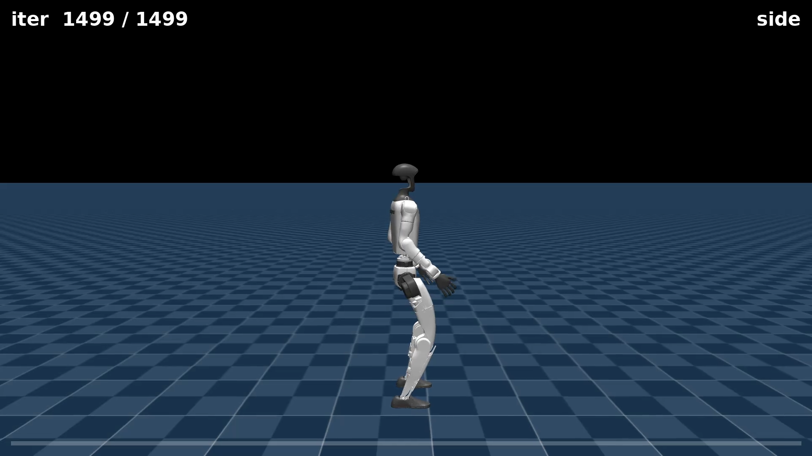
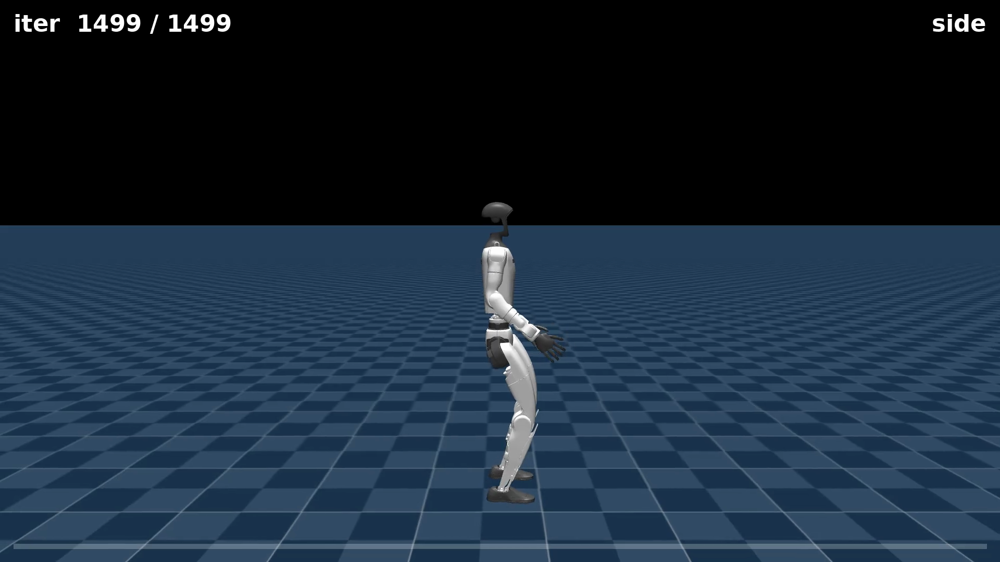

# Chapter 10 — More Gaits and the Command System

*Part IV: Reward Engineering*

*This chapter assumes you have read chapters 01–09, and in particular that you know what the [velocity tracking task](06-watching-it-walk.md) is, what [reward terms](06-watching-it-walk.md) and [reward curves](05-reading-the-training.md) look like, and how the [curriculum-clobber](08-turning-the-knobs.md) works. No new training technique is introduced here — the chapter is an honest audit of what the existing technique can and cannot do.*

---

## What this chapter is about

Chapters 06 through 09 all worked with the same robot moving forward. It walked, it jogged, it dived. But the training task was designed for much more than that. Before the chapter is out, you will understand exactly what instructions the robot receives each timestep — not just "go forward," but a three-number vector that can point it in any direction or spin it in place. And you will see what happens when you exercise that interface: one new behavior works immediately, another works only partially, and the gap between them tells you something real about the robot's limits.

---

## The command/twist system: what the robot is actually told

Every timestep, before the robot's brain (the policy neural network) decides what to do with its joints, it reads a small packet of numbers from its **observations**. We have been talking loosely about "commanding a forward velocity," but there are actually three numbers in that command, sent simultaneously:

- `lin_vel_x` — target linear velocity along the robot's forward axis (positive = forward, negative = backward), in metres per second.
- `lin_vel_y` — target linear velocity along the robot's sideways axis (positive = left, negative = right), in metres per second.
- `ang_vel_z` — target angular velocity around the robot's vertical axis (positive = turning left / counter-clockwise), in radians per second.

Together, this three-number vector is called the **twist command** — a standard term from robotics for the combination of linear and angular motion. Think of it as a tiny remote-control joystick update, delivered fresh every timestep, telling the robot "at this moment, try to be moving like this."

> **Command / twist system** — the interface that sends `(lin_vel_x, lin_vel_y, ang_vel_z)` to the policy each timestep. The policy's brain reads these three numbers as part of its observation and produces joint torques intended to match them. Changing what you put into the twist is how you change the robot's goal behavior without touching the reward function or rewriting any code.

The policy does not receive a destination — "go to point B." It receives a *velocity*, and it must maintain that velocity continuously. Keeping a 1 m/s forward velocity for ten seconds requires a thousand consecutive good decisions, each one reading the current command and the current joint state and outputting something that nudges the body in the right direction.

The `track_lin_vel` and `track_ang_vel` reward terms (introduced in [chapter 06](06-watching-it-walk.md)) each fire every timestep and compare the robot's actual velocity against these three target numbers. The closer the match, the higher the reward that timestep.

---

## Insight: what the policy observes vs. what the policy controls

The policy network (roughly 200,000 weights, hidden layers 512 → 256 → 128) maps the observation to joint torques. The observation is a list of numbers that includes: the three twist-command values just described, the robot's current joint angles and velocities across its 23 actuated joints, and various body-state estimates (orientation, foot contacts, etc.). The twist command is literally among the numbers the policy reads as its input every single step. Change the command, and the robot reads a different input — the policy naturally steers toward a different target without any retraining, as long as the new command was in the distribution the policy trained on.

---

## The curriculum-clobber: why one override is not enough

Here is the subtlety that trips up almost everyone the first time. When you train, you do not set the command once at the start and hold it there. The task has a built-in **speed curriculum** — a sequence of difficulty stages that progressively widens the range of commanded velocities as training advances. But there is a timing detail: the curriculum's **stage-0 callback fires at every episode boundary** — each time the robot resets — and overwrites the current command range with whatever the stage-0 definition says.

This is the curriculum-clobber introduced in [chapter 08](08-turning-the-knobs.md). If you add `--env.commands.twist.ranges.lin-vel-x=(-1.0, -1.0)` to pin backward walking, the command is indeed set when training starts — and then silently overwritten the moment the first episode ends, roughly 20 seconds later.

To hold the command fixed, you must override the command range *and* all three curriculum stages simultaneously, using `=`-syntax for tuple arguments:

```bash
"--env.commands.twist.ranges.lin-vel-x=(-1.0, -1.0)"
"--env.curriculum.command-vel.params.velocity-stages.0.lin-vel-x=(-1.0, -1.0)"
"--env.curriculum.command-vel.params.velocity-stages.1.lin-vel-x=(-1.0, -1.0)"
"--env.curriculum.command-vel.params.velocity-stages.2.lin-vel-x=(-1.0, -1.0)"
```

Four lines, not one. This is the command-vs-curriculum interaction in practice.

> **Command-vs-curriculum interaction** — the runtime relationship between the command ranges you specify in training configuration and the curriculum callback that overwrites those ranges at every episode reset. A plain command-range override is not sufficient on this task; the curriculum stages must be overridden too, or they will clobber your setting on every reset.

---

## Gait 1 — Spin in place

The first experiment zeros the linear velocities and pins a positive yaw rate: `lin_vel_x = 0`, `lin_vel_y = 0`, `ang_vel_z = 1.0` rad/s. The robot is told to rotate on the spot and go nowhere.

The full training command, with the four-line curriculum fix applied:

```bash
python -m mjlab.scripts.train \
  Mjlab-Velocity-Flat-Unitree-G1 \
  --env.scene.num-envs 2048 \
  --agent.max-iterations 1500 \
  "--env.commands.twist.ranges.lin-vel-x=(0.0, 0.0)" \
  "--env.commands.twist.ranges.lin-vel-y=(0.0, 0.0)" \
  "--env.commands.twist.ranges.ang-vel-z=(1.0, 1.0)" \
  "--env.curriculum.command-vel.params.velocity-stages.0.lin-vel-x=(0.0, 0.0)" \
  "--env.curriculum.command-vel.params.velocity-stages.1.lin-vel-x=(0.0, 0.0)" \
  "--env.curriculum.command-vel.params.velocity-stages.2.lin-vel-x=(0.0, 0.0)" \
  "--env.curriculum.command-vel.params.velocity-stages.0.ang-vel-z=(1.0, 1.0)" \
  "--env.curriculum.command-vel.params.velocity-stages.1.ang-vel-z=(1.0, 1.0)"
```

Same task, same 2048 parallel robots, 1500 iterations (~25 minutes on the DGX Spark). No new reward terms, no code changes.

Here is what emerged — side camera:

<video controls autoplay loop muted playsinline preload="auto" width="100%" poster="assets/gait_spin_still.png">
  <source src="assets/gait_spin_side.mp4" type="video/mp4">
  Your browser doesn't support embedded video — <a href="assets/gait_spin_side.mp4">download the clip</a> instead.
</video>

Chase camera:

<video controls autoplay loop muted playsinline preload="auto" width="100%" poster="assets/gait_spin_still.png">
  <source src="assets/gait_spin_chase.mp4" type="video/mp4">
  Your browser doesn't support embedded video — <a href="assets/gait_spin_chase.mp4">download the clip</a> instead.
</video>



**A clean, first-try success.** The robot stays over its own footprint and pivots — stepping its feet in a little arc around the vertical axis, torso upright, drift near zero. Final training reward: approximately **76**, which is notably higher than the forward walker's ~50.

Why higher? Spinning in place is, in reward terms, a somewhat simpler command to satisfy. The robot is not asked to translate, so the `track_lin_vel` component is always fully satisfied (no linear target to miss). All the training effort concentrates on matching the yaw rate, and the robot's morphology (two feet, centered mass) naturally accommodates rotation without any additional balancing challenge. The policy converged cleanly in 1500 iterations with no surprises.

---

## Gait 2 — Walk backward

The second experiment is almost as simple to specify: pin `lin_vel_x = -1.0` m/s (the negative sign is backward). Everything else — number of robots, number of iterations, task — stays the same.

```bash
python -m mjlab.scripts.train \
  Mjlab-Velocity-Flat-Unitree-G1 \
  --env.scene.num-envs 2048 \
  --agent.max-iterations 1500 \
  "--env.commands.twist.ranges.lin-vel-x=(-1.0, -1.0)" \
  "--env.curriculum.command-vel.params.velocity-stages.0.lin-vel-x=(-1.0, -1.0)" \
  "--env.curriculum.command-vel.params.velocity-stages.1.lin-vel-x=(-1.0, -1.0)" \
  "--env.curriculum.command-vel.params.velocity-stages.2.lin-vel-x=(-1.0, -1.0)"
```

Side camera:

<video controls autoplay loop muted playsinline preload="auto" width="100%" poster="assets/gait_backward_still.png">
  <source src="assets/gait_backward_side.mp4" type="video/mp4">
  Your browser doesn't support embedded video — <a href="assets/gait_backward_side.mp4">download the clip</a> instead.
</video>



**An honest partial.** The robot stays upright and steps backward — this is real backward locomotion, not falling or failing. But it tracks the −1.0 m/s command noticeably less cleanly than the forward walker tracks its target. Final training reward: approximately **39**, versus ~50 for the forward walker and ~76 for the spin.

Watch the clip carefully: the gait is choppy, the feet linger longer than they should, and the robot's torso rocks more than in forward walking. It is making progress in the right direction but at the wrong speed and with less stability. The speed error is measurably higher than the forward walker's.

This is not a training failure — 1500 iterations is enough to show a clear direction. It is a genuine physical difficulty. The G1's anatomy is designed and tuned for forward motion: the ankle joint range, the mass distribution across the chassis, and the reward function were all developed with forward locomotion in mind. Asking the same policy structure to track a backward velocity with the same reward weights and the same number of training steps produces a weaker result. Backward walking is harder for this morphology.

> **Insight: "a command change" is not a guarantee**
>
> The spin and the backward walk were produced by the same technique — change one number, override the curriculum stages, train. From the outside they look identical to specify. But the results are not equivalent. The spin policy is clean; the backward policy is a work in progress. The twist system gives you a dial, but turning the dial does not promise equal quality in every direction. Some commands are harder than others for a given robot, and the same training budget may not be enough to solve them equally well.

---

## The lesson: same recipe, unequal results

Put the three reward numbers side by side:

| Gait | `lin_vel_x` | `ang_vel_z` | Reward | Quality |
|---|---|---|---|---|
| Forward walk (ch06 baseline) | `+1.0` m/s | `0.0` | ~50 | Clean, converged |
| Spin in place | `0.0` | `+1.0` rad/s | ~76 | Clean, first-try |
| Backward walk | `−1.0` m/s | `0.0` | ~39 | Upright but choppy, partial |

The technique used is identical across all three. The configuration difference is one number: the sign of the velocity, or which velocity component is active. Yet the outcomes span from "first-try success" to "solid partial," and the reward scores spread across a 37-point range.

This does not mean the twist system is unreliable — it means that different commands place different demands on the robot's physics and on the reward signal. The spin rewards heavily and cleanly because one component of the tracking error is always zero. Backward tracking rewards less because the robot has to fight its own morphology in a direction it was never specifically tuned for.

The deeper point is continuous with the theme of the last several chapters: **a number — the reward — tells you something, but not everything.** Reward 76 for spinning is not "better" than reward 39 for backward walking in any absolute sense. They are measuring compliance with different commands under different difficulty levels. Comparing reward across different command conditions requires understanding what each reward was measuring.

---

## What you now understand

- **The command/twist system** — the `(lin_vel_x, lin_vel_y, ang_vel_z)` vector the policy reads each timestep. The three numbers together specify a full 2D planar motion target, not just a forward speed.
- **The command-vs-curriculum interaction** — a plain command-range override is insufficient on this task because the curriculum re-randomizes the command at every episode reset. You must override both the range and all three curriculum stages.
- **Spin in place** — zeroing the linear components and pinning a yaw rate produces a clean pivoting gait (reward ~76) in 1500 iterations. First-try success.
- **Backward walk** — negating `lin_vel_x` produces upright backward stepping but tracks the −1 m/s command less cleanly than forward walking (reward ~39). An honest partial, not a failure — the robot is doing the right thing, just less precisely than forward walking.
- **Same recipe, unequal results** — the twist system is a uniform interface, but different commands place different physical demands on the robot. Equal training budgets do not guarantee equal output quality across all commands.

Next: [Chapter 11 — The Reward-Hacking Gallery](11-the-reward-hacking-gallery.md). The last two chapters have caught the policy doing something wrong while the reward went up (the dive) and something right but unfinished (backward walking). Chapter 11 collects a broader gallery of these cases: experiments where removing or changing a reward term produces unexpected behavior, and where the score reports success while the behavior tells a different story.

---

*All experiments: Unitree G1 on flat terrain, MuJoCo-Warp simulator, DGX Spark (NVIDIA GB10, aarch64). 2048 parallel robots, 1500 iterations per gait (~25 minutes each), pure command/curriculum overrides — no new reward terms, no code changes. Forward-walk baseline from Session 1 (2048 robots, 2050 iterations).*
