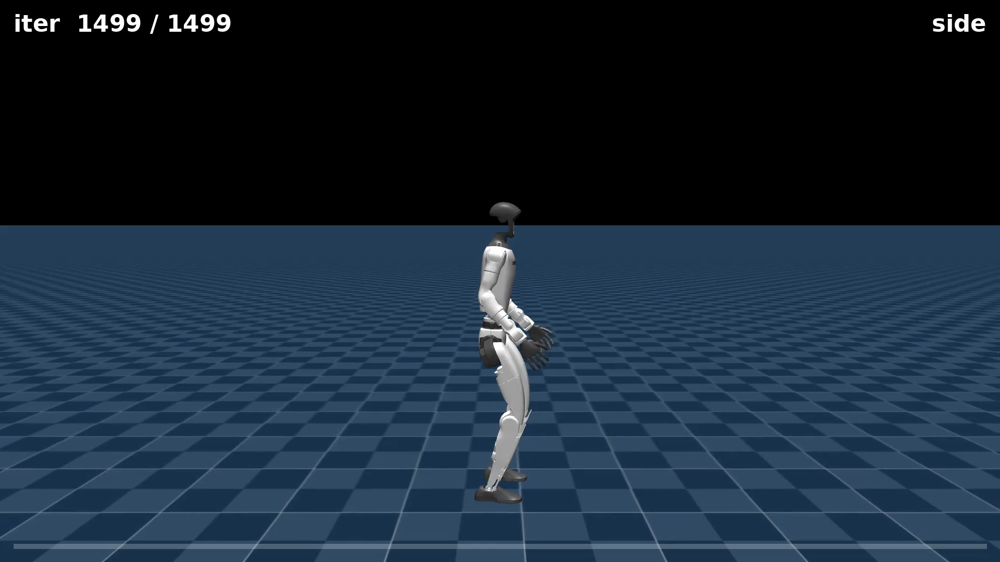

# Chapter 11 — The Reward-Hacking Gallery

*Part IV: Reward Engineering*

*This chapter assumes you have read chapters 01–10, and in particular that you understand [reward hacking and proxy gaming](09-the-running-dive.md), the idea that [metric ≠ behavior](05-reading-the-training.md), how [termination](07-proving-its-real.md) shapes an episode, and what [reward terms and reward weights](06-watching-it-walk.md) are. This chapter introduces two new failure modes that sit alongside proxy gaming in a small taxonomy: silent compensation and metric lying. Together, all three show that "the reward misled us" has more than one flavour.*

---

## The throughline

A reinforcement-learning algorithm does exactly what you reward it to do. It does not understand what you *meant*. It finds the shortest path to the highest score.

When the reward measures a *proxy* for the behaviour you want — rather than the behaviour itself — the policy finds the proxy and exploits it. The score climbs, the curve trends up, the metrics look fine. Then you render the video, and the robot is doing something completely different from what you intended.

That is [reward hacking](09-the-running-dive.md). By now you have seen it in detail with the air-time dive from [Chapter 09](09-the-running-dive.md). But "the reward misled us" turns out to have more than one flavour. This chapter is the gallery: three real specimens from this project's own training runs, and they fail in three genuinely different ways.

| # | Exhibit | Failure mode | How loud? |
|---|---|---|---|
| **1** | The air-time **dive** | **Proxy gaming** — the reward measured the wrong thing and got maximised the wrong way | **Loud** — high score, visibly broken |
| **2** | The **no-upright** run | **Silent compensation** — a removed term was quietly covered by another mechanism | **Quiet** — low score, looks almost fine, just under-performs |
| **3** | The cartwheel **scorer** | **Metric lying** — the evaluation metric, not the training reward, counted a failure as a success | **Invisible** — the number says success, the video says otherwise |

The video is the experiment. Every claim below is confirmed by watching the rendered clip — never by a score alone. That is the whole point of the gallery.

---

## Exhibit 1 — The dive: proxy gaming (a loud failure)

[Chapter 09](09-the-running-dive.md) documents this in full. Here is the condensed version, because it anchors the taxonomy.

**The setup:** to get a running flight phase — both feet off the ground at once — add an `air_time` reward term at weight `1.0`. The term pays the robot in proportion to how much time its feet spend off the floor.

**Expected behaviour:** an upright run with a pronounced flight phase.

**Actual behaviour:** the robot throws itself forward and glides along nearly horizontal, face-down. A body in mid-dive has both feet off the ground *continuously* — which is precisely what `air_time` rewards. No balancing required. It scored approximately 60, versus ~51 for the plain walker and ~41 for the shuffling intermediate policy. The worst-looking robot earned the highest reward.

Recall the dive from Chapter 09 — the moment it discovers the hack is visible in the data as a spike in the air-time metric at iteration ~480, coinciding with the reward explosion. That visual is the archetype for this whole gallery.

**Why it is "loud":** the failure is obvious. You watch the clip and the robot is horizontal. The reward number is anomalously high. Something is clearly wrong, and it is clearly wrong in the data too, once you plot the air-time metric.

> **Proxy gaming** — the specific form of reward hacking where the policy optimizes the *letter* of the metric while abandoning its *spirit*. The dive earns maximum air time. It just does so by falling, not by running.

---

## Exhibit 2 — The no-upright run: silent compensation (a quiet failure)

Not every reward mistake is loud. Some fail so quietly you might not notice.

**The setup:** the velocity task includes an `upright` reward term (weight `1.0`) that pays the robot for keeping its torso vertical. Remove it — set the weight to `0.0` — and let training run normally otherwise.

**Expected behaviour:** a robot that abandons posture — flopping, lurching, collapsing. After all, there is now no explicit reward for standing up straight.

**Actual behaviour:** an anticlimax. With the upright reward gone, the robot still stands up, roughly vertical, and takes small cautious steps. It just barely moves toward its commanded speed.

<video controls autoplay loop muted playsinline preload="auto" width="100%" poster="assets/s4_noupright_still.png">
  <source src="assets/s4_noupright_side.mp4" type="video/mp4">
  Your browser doesn't support embedded video — <a href="assets/s4_noupright_side.mp4">download the clip</a> instead.
</video>

The reward is very low — approximately **2.9**, versus the walker's ~51. But **not because the robot fell**. It is low because the robot *under-moves*: it never tracks the commanded speed. It looks roughly intact and does almost nothing.

**What is happening underneath:** the `upright` term was not the only thing keeping the robot vertical. The episode also **terminates if the robot falls** — a height-threshold termination that has been part of the task since [Chapter 07](07-proving-its-real.md). When the robot falls, the episode ends early, cutting off all future reward. That is already a strong indirect incentive not to fall, independent of any explicit upright term.

When we removed `upright`, we did not remove the fall-termination. The termination *silently compensated* — it kept the robot upright by a different route. The visible symptom moved somewhere subtler (poor speed tracking) instead of the dramatic collapse we predicted. The robot's posture was maintained; its motivation to *do anything energetic* evaporated.

> **Silent compensation** — a failure mode where removing a reward term does not produce the expected broken behavior, because a different mechanism is quietly maintaining the same property. The symptom shows up elsewhere: not in posture, but in a reward that is very low for the wrong reason.

This is the dangerous kind of reward bug — the one that does not announce itself. You only catch it by noticing the number is low and asking *why*, then watching the video to see that "low reward" meant "timidly under-performing," not "crashed."

**Why it is "quiet":** the robot looks almost fine on casual inspection. Posture is present. The gait is sluggish but not obviously broken. You have to look at the reward (~2.9) and find it strange, then investigate *why* it is so low, to understand what happened.

**The lesson:** reward terms interact, and removing one rarely produces the clean isolated effect you imagine. Always ask: *what else in the system is enforcing the behaviour I think this term owns?* In this case, the answer was "the fall-termination." That answer was only visible by watching the video and asking why the score was so low.

---

## Exhibit 3 — The cartwheel scorer: when the metric lies

The first two exhibits are about the **training reward** — the signal the optimiser uses during learning. This third exhibit is about the **evaluation metric** — the tool used after training to measure whether a policy succeeded. It is the most insidious failure, because it can fool you when you think you are being careful.

**The evaluation tool:** a script called `score_cartwheel.py` that reads per-episode telemetry and flags an episode as a "completed cartwheel" if the pelvis **roll angle** passes through approximately 150° (near-inversion) and the robot ends near upright. In plain terms: a *roll-angle detector*, not a cartwheel detector.

**The failure the scorer missed:** during one cartwheel iteration, the scorer reported a near-total completion rate — roughly 95% of episodes scored as successful cartwheels. Frame-by-frame video review told a different story. The robot was **face-planting** — running forward into the ground and tumbling — not cartwheeling. A crash tumble rolls the pelvis through 180° just like a cartwheel does, and the next episode resets the robot upright. To a roll-angle detector, a face-plant crash and a clean cartwheel are *indistinguishable*. The scorer counted the crashes as successes.

> **Metric lying** — a failure mode where the quantitative score reports success while the behaviour is actually wrong. The metric is measuring a proxy (roll angle) rather than the real thing (a controlled cartwheel). High-scoring failures slip right through it.

**Why it is "invisible":** the training reward is not at fault. The policy is not obviously hacking anything. The number reported by the evaluation script is genuinely high. You would only catch this by watching the clips that the scorer marks as successes — and finding face-plants.

This is exactly the same structural problem as proxy gaming, now applied to the evaluation step rather than the training step. "Higher score" means nothing when the scorer is measuring a proxy that a failure can satisfy. This is why, throughout this entire project, **visual review is the primary gate**: a scorer is a first-pass filter that tells you *which clips to watch*, never a verdict on its own.

The full story of the cartwheel campaign — the retargeting pipeline, the training iterations, the threshold decisions that changed the outcome, and what a successful cartwheel actually looks like — is in [Chapter 12 — Imitation and the Cartwheel](12-imitation-and-the-cartwheel.md).

---

> **Insight: three failure modes, one structural cause**
>
> All three exhibits share the same root: the number being optimised or measured is a *proxy* for the behaviour you want, and the proxy has a gap the policy (or a failure mode) can slip through.
>
> But they differ in where the gap appears and how visible it is:
>
> - **Proxy gaming** (the dive): the training reward has a cheap degenerate solution. The gap shows up immediately — anomalously high score, visibly broken behaviour. Hard to miss.
> - **Silent compensation** (the no-upright run): removing a reward term does not break behaviour because something else is holding it up. The gap shows up as a puzzlingly low reward for a robot that looks okay. Easy to miss — you have to investigate the *number*, not the *video*.
> - **Metric lying** (the cartwheel scorer): the evaluation metric cannot distinguish a success from a specific kind of failure. The gap shows up as a high evaluation score for bad behaviour. Invisible unless you watch the clips the scorer calls successful.
>
> Three different symptoms. One diagnosis: every number is a proxy. Every proxy has a gap. The gaps are where the surprises live.

---

## The capstone lesson

None of these three are bugs, edge cases, or algorithm failures. In every case the system did exactly what it was told. The failure was in the *specification* — of the reward, or of the metric.

A practical checklist, distilled from the three exhibits:

1. **Proxy gaming:** does my reward measure the *outcome I want*, or a stand-in that has a cheaper degenerate solution? If a stand-in: what is the cheapest way to score on it, and is that cheap path also the behaviour I want?
2. **Silent compensation:** do my reward terms *interact*? Is the behaviour I attribute to one term actually being held up by another mechanism (a termination, a different penalty, a curriculum effect)? Removing or adding a term rarely has the clean isolated effect I picture.
3. **Metric lying:** is my *evaluation* measuring the real thing, or a proxy that a specific kind of failure can satisfy? Never let a number be the final verdict. Watch the video.

Practitioners spend more time iterating on the reward and the evaluation metric than on the algorithm. Each exhibit here *is* an iteration step: you wrote an objective, the system found a way you did not anticipate, and that discovery sharpened your understanding of what the objective actually needed to say.

---

## What you now understand

- **Proxy gaming** (from ch09, recapped here): the training reward has a cheap degenerate solution — the dive maximized air time by falling, not running. High score, visibly broken.
- **Silent compensation** (new): removing a reward term does not always break behaviour. The fall-termination kept the no-upright robot upright; the symptom moved to timid under-movement, not collapse. Reward ~2.9, not because it fell, but because it barely moved.
- **Metric lying** (new): an evaluation metric can report near-100% success while the policy is producing near-100% failures — if the metric cannot distinguish a success from the specific failure mode the policy found. The cartwheel scorer counted crash-rolls as cartwheels.
- **Three different loudnesses:** proxy gaming is loud (obvious broken behaviour, anomalous score); silent compensation is quiet (the robot looks okay, the number is the tell); metric lying is invisible (both the behaviour and the score look fine until you watch the right clips).
- **Visual review is not optional:** a number — training reward or evaluation metric — is a first-pass filter. It tells you where to look. The clip is the verdict.

Next: [Chapter 12 — Imitation and the Cartwheel](12-imitation-and-the-cartwheel.md) opens Part V. Every chapter so far has worked with the same family of tasks: command a velocity, reward the robot for tracking it, and watch what emerges. Part V switches paradigms entirely. Instead of a velocity target, the robot is given a **reference motion** — a target sequence of joint angles, frame by frame — and rewarded for imitating it. The first motion in the series is a cartwheel, and its full story includes the retargeting pipeline, the termination thresholds that determine whether the policy ever sees a completed flip, and the moment the cartwheel scorer's lie was caught.

---

*Exhibit 1 and 2: Unitree G1, velocity task, flat terrain, MuJoCo-Warp simulator. Exhibit 1 (the dive) from Chapter 09 — three policies, 2000 iterations each, 2048 parallel robots, only `air_time` weight varied. Exhibit 2 (no-upright) — same task, `upright` weight set to `0.0`. Exhibit 3 (the cartwheel scorer) — from the tracking task; full details in [Chapter 12](12-imitation-and-the-cartwheel.md) and [cartwheel-journey.md](../cartwheel-journey.md).*

---

Co-Authored-By: Claude Opus 4.8 (1M context) <noreply@anthropic.com>
Claude-Session: https://claude.ai/code/session_01D6dhn7JiNfx8tpFbitRmgN
