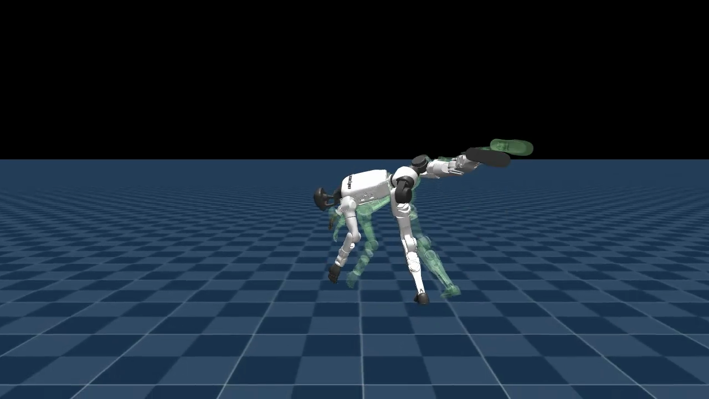

# Chapter 12 — Imitation and the Cartwheel

*Part V: A New Paradigm*

*This chapter assumes you have read chapters 01–11, and in particular that you understand what a [policy](02-the-vocabulary.md) is, how [reward terms](06-watching-it-walk.md) shape behavior, what an [episode](02-the-vocabulary.md) is, how [termination](07-proving-its-real.md) ends one, how the [reward curve](05-reading-the-training.md) tells us whether learning is progressing, and what [metric lying](11-the-reward-hacking-gallery.md) looks like in practice. This chapter opens a new section of the curriculum by introducing a completely different training paradigm — motion imitation — and telling the story of the first motion we successfully taught: a cartwheel.*

---

## Part V begins here

Every chapter so far has worked the same way. You decide what you want the robot to accomplish — walk forward at 0.5 m/s, spin in place, run with a flight phase — and you encode that desire as a collection of reward terms. The policy then discovers, through millions of trials, some behavior that scores well on those terms. You do not choreograph the movement; the robot invents it.

That approach works well for locomotion. But imagine you want the robot to do a cartwheel. How would you write that as reward terms? "Stay airborne for a specific fraction of a second." "Rotate through exactly 180 degrees." "Land with both feet." Each term individually is gameable — the dive from [Chapter 09](09-the-running-dive.md) showed how easily the policy finds unintended shortcuts when you reward a proxy for what you actually want.

There is a cleaner option. Show the robot a recording of a real cartwheel and reward it for *matching that recording*, frame by frame.

That is **motion imitation** — a training paradigm where instead of writing down a goal to achieve, you provide a target sequence of poses to reproduce. The policy is not rewarded for "inverting" or "landing" in the abstract. It is rewarded for placing each of its joints where the reference motion says they should be, at each moment in time. Get close: high reward. Drift away: reward falls. The behavior emerges from the policy learning to track, not from a designer specifying what tracking should produce.

---

## What a reference motion is

A **reference motion** is a time-indexed sequence of joint angles — the G1's body position reconstructed at each timestep of a specific movement. Think of it as a very detailed pose recording: "at 0.0 seconds the right knee is at this angle and this position; at 0.1 seconds it is here; at 0.2 seconds it is here." Strung together, these poses trace out a motion through time.

For this project the reference is a 2.73-second MimicKit cartwheel clip — a human gymnast's cartwheel that has been mathematically mapped onto the G1's joints and proportions. The clip runs: standing → crouch and plant hands → one-arm handstand with leg sweeping overhead → airborne inversion → land → stand. Each of these moments is one frame of the reference, and the policy's job is to reproduce all of them in order.

The reference is not a video file the robot "watches." It is a structured data file — a `.npz` file — that the simulator reads one timestep at a time and serves to the policy as a target: "here is where your right shoulder joint should be right now; here is where your left ankle should be; here is where your pelvis should be." At every step, the policy receives a reward based on how close it came.

---

## The retargeting pipeline

A human gymnast and the G1 humanoid do not share the same proportions, the same joint layout, or the same degrees of freedom. A raw motion-capture file recorded from a human cannot be fed directly into the G1's simulator — the dimensions are wrong and many human joint configurations are physically impossible for the robot.

The **retargeting pipeline** is the process that bridges this gap: converting a human or SMPL motion-capture file into a G1-compatible reference motion. In this project the steps are:

```
MimicKit .pkl file
   → pkl_to_csv.py             (extract joint trajectories as a CSV table)
   → mjlab.scripts.csv_to_npz  (re-express those trajectories in G1 joint coordinates)
   → motion.npz                (the reference file used for training)
```

At each stage the motion is being re-expressed in a different coordinate system. The `.pkl` file describes a human skeleton. The CSV extraction converts that into a standardized tabular form. `csv_to_npz` then maps the human skeleton's joint angles onto the G1's joints — rescaling for limb length, respecting the robot's joint limits, and expressing the pose in the G1's own coordinate frame. The output `.npz` is what the tracking environment reads.

For acrobatic motions, this pipeline has a hard limit: **retargeting degrades in aerial phases**. When a human is airborne, the motion-capture system tracks a body that follows human physics. When the retargeter maps that onto the G1, small rounding errors in the airborne frames can accumulate into large pose errors, making the reference harder for the policy to track. This is why hand-curated retargets — like the MimicKit cartwheel, which was already expressed for the G1 — work better for aerobatics than fully automated retargeting would.

---

## The tracking reward

Once you have a reference motion in `.npz` form, you need a reward that tells the policy how closely it is matching it. The tracking reward used here is:

```
reward = exp(-(error²) / std²)
```

This formula needs unpacking. First, the intuition; then the symbols; then why this particular shape is a good choice.

### The intuition

Imagine a scoring system for a gymnast. A perfect match to the reference earns full marks — 1.0. As the gymnast's body drifts from where the reference says it should be, the score falls. A small drift costs a little. A large drift costs a lot. But the score never goes negative — it just approaches zero asymptotically as the drift grows. The reward function is a smooth ramp from "perfectly matched" down to "completely off."

That is exactly what this formula produces. When the robot's pose exactly matches the reference, `error` is zero, the exponent becomes zero, and `exp(0) = 1.0` — full reward. As the robot drifts, `error` grows, the exponent becomes more negative, and the reward decays smoothly toward zero. There is no cliff, no hard threshold, no discontinuity. The policy receives a continuous gradient signal: "you are close — get closer."

### The formula, symbol by symbol

```
reward = exp(-(error²) / std²)
```

- `error` — the distance between the robot's current pose and the reference pose at this timestep. Concretely, this is computed over a set of tracked body positions (the pelvis, the end-effectors — hands and feet — and key joint angles). A small `error` means the robot is nearly where the reference says it should be. A large `error` means it has drifted far from the reference.

- `std` — the tolerance: a fixed number set by the designer that controls how quickly the reward decays as `error` grows. A large `std` means the reward falls off gently — the policy can drift quite a bit before losing much reward. A small `std` means the reward is tight — even a small drift costs significantly. For this project `std` is set to match the scale of the tracked positions, so a mismatch of roughly one standard deviation halves the reward.

- `error²` — the squared error. Using the square rather than the raw error makes the penalty grow faster as the robot drifts further. A robot that is twice as far from the reference receives more than twice the penalty. This discourages large drifts more strongly than small ones.

- `exp(...)` — the exponential. Whatever the squared-and-scaled error comes out to, `exp(−x)` maps it to the range (0, 1]. At `x = 0` the reward is 1.0. As `x` grows, the reward falls but never reaches zero.

Put together: the robot earns near-perfect reward when it is close to the reference, earns decreasing reward as it drifts, and earns near-zero reward when it is far off — all on a smooth continuous curve that the optimizer can follow all the way from "completely lost" to "nearly perfect."

> **Insight: why exp(−error²/std²) is the right shape for an imitation reward**
>
> When you write reward terms for locomotion — track speed, stay upright, penalize jerk — you are combining several signals, each measuring something different. The policy can satisfy all of them imperfectly and still score well.
>
> The tracking reward is different. There is only one signal: how far is the robot from the reference? But that single signal needs to be *informative at every level of accuracy*. If the reward were binary — "within 0.5 m gets 1, outside gets 0" — the policy would receive no gradient from where it currently is toward where it needs to go, except at the exact threshold boundary.
>
> `exp(−error²/std²)` is always informative. A robot that is 0.9 m from the reference gets a very small but non-zero reward. A robot that cuts that to 0.8 m gets a measurably higher reward. The gradient exists everywhere, from hopelessly lost all the way to nearly perfect. The policy can always take a step in the right direction and receive a signal that it did.
>
> The squaring and the exponential together also ensure that *close is disproportionately better than far*. This pushes the policy to pursue precision, not just approximate proximity.

---

## Termination thresholds: the thing that almost broke the cartwheel

With velocity tracking you set a termination condition based on the robot falling — something like "if the robot's torso drops below 0.5 m, end the episode." This makes sense: a fallen robot is not going to learn walking from that state.

The tracking environment uses a different kind of termination condition. An episode ends if the robot's pose drifts too far from the reference — specifically, if the pelvis position (`anchor_pos`) or any end-effector position (hands or feet — `ee_body_pos`) drifts more than some threshold distance from where the reference says they should be.

The **termination threshold** is that distance: the maximum allowed pose error before the episode is cut short.

This design makes sense in principle: if the robot is so far from the reference that it has no hope of recovering, there is no useful learning to be had in that episode, so resetting and starting over is more efficient. But it has a sharp edge for aerobatic motions.

During a cartwheel, the arms and legs sweep through wide arcs — the hands plant on the ground while the legs kick overhead. A policy that is still *learning* how to do this will naturally drift somewhat from the reference during the aerial phase. At the stock threshold of **0.25 m**, that drift is enough to trigger a termination — the episode resets *before the policy has ever seen or experienced a completed cartwheel*. And without ever experiencing a completion, the policy cannot learn to land.

This is what happened in the first training run (iterA). The policy tried to cartwheel, got partway through the launch, drifted beyond 0.25 m from the reference, was terminated, reset to the starting pose, and tried again — forever. The reward hovered low. No cartwheels completed.

The fix was conceptually simple: raise the threshold to **0.5 m**. This gave the policy enough tolerance to experience a full rotation — drifting somewhat during the aerial phase, but completing the motion and receiving the rewards at the landing — and thus enough signal to learn the complete trajectory.

One caution: the same threshold used during training must be used during rendering, or the render will cut the episode short at the old threshold and you will never see the completed motion on screen. This was one of the bugs that made iterB's evaluation look wrong — the render was still using 0.25 m while training had used 0.5 m.

---

## The three iterations

### IterA — the threshold problem (20 000 iterations)

Stock thresholds (0.25 m), default reference (`mimickit_cartwheel.npz`), 4096 parallel environments, trained from scratch. Reward bobbed in the 3–5 range for the full training run and never broke out. Visual review: the policy attempted a cartwheel launch, the termination fired mid-flip, the episode reset. No completed cartwheels observed.

The hypothesis going into iterB: the tolerance is too tight for an aerial motion. The policy is doing a reasonable cartwheel *shape* but the termination fires before it finishes.

### IterB — the scorer lied (warm-start + 5 000 iterations)

Thresholds raised to 0.5 m. Training warm-started from the iterA checkpoint. An automated scorer (`score_cartwheel.py`) flagged 95% of episodes as successful cartwheels.

It was wrong.

The scorer measured one proxy: whether the pelvis roll angle passed through approximately 150° and the robot ended near upright. A cartwheel does satisfy this. So does a **crash-roll** — a robot that face-plants and tumbles forward, with the post-reset standing frame counting as the "recovery." The scorer could not tell the difference.

This is the payoff of everything Chapter 11 established about **metric lying**. Chapter 11 introduced the cartwheel scorer as Exhibit 3 — the metric that silently counts failures as successes. Now you see the full picture. The policy in iterB was not cartwheeling. It was flopping. The scorer saw "pelvis rotated through 180°" and "robot ends upright" — both true — and filed the result as a success. 95% success. All crashes.

Frame-by-frame video review told a different story: the robot pitched forward, hit the ground face-first, and tumbled. Not a cartwheel. The scorer had been measuring a proxy rather than the real behavior, and the proxy had a gap the failure mode slipped through cleanly.

Two additional bugs compounded the confusion. The rendering environment still used the old 0.25 m thresholds, so every rendered attempt was cut short mid-motion before the face-plant even landed on screen — making the video look incomplete rather than wrong. And the reference file itself was inadvertently two cartwheels long (a tooling bug in `pkl_to_csv --duration`), so the policy was trying to match a 6-second double-cartwheel clip rather than the intended 2.73-second single cartwheel. The reference was infeasible from the start.

### IterC — the successful cartwheel (20 000 iterations, from scratch)

Three simultaneous fixes:

1. A new single-cartwheel reference: `mimickit_cartwheel_single.npz`, correctly 4.22 seconds (0.5 s entry transition + 2.73 s cartwheel + 0.5 s exit + 0.5 s pad).
2. 0.5 m termination thresholds in both training and rendering.
3. Training from scratch — no warm-start from iterB's stuck policy.

The reward climbed immediately: from near-zero to 18 by iteration 1 000, to 27 by iteration 2 000, plateauing around 32 by iteration 4 500 (versus iterA/B's stuck 3–5). A mid-run visual check at iteration 4 500 showed:

- t ≈ 1.1 s: prep stance, arms spread — a real gymnast preparation shape, not a flop
- t ≈ 1.5 s: one-handed planted handstand with leg kicked up overhead
- t ≈ 1.75 s: fully airborne, body rotating
- t ≈ 2.75 s: lands on both feet in a crouched recovery
- t ≈ 3.75 s: standing upright; policy repeats the reference motion
- t ≈ 6.25 s: second cartwheel inversion

**Not a flop. Not a face-plant. A real cartwheel.**

Training ran to 20 000 iterations. The final policy (`model_19999.pt`) was evaluated in a 40-second continuous rollout with terminations disabled — so the policy runs the reference motion continuously without reset teleportation. At least four full cartwheels were observed, each with a proper airborne inversion and a two-footed landing. None of the "face-plant then post-reset stand" artifacts that fooled the scorer in iterB appeared in visual review.

---

## The clips

The final iterC policy (`model_19999.pt`), from two angles. Where the rendered robot overlaps the faint reference ghost displayed alongside it, the policy is tracking the motion closely — the visual signature of a *working* imitation policy.



<video controls autoplay loop muted playsinline preload="auto" width="100%" poster="assets/cartwheel_still.png">
  <source src="assets/cartwheel_side.mp4" type="video/mp4">
  Your browser doesn't support embedded video — <a href="assets/cartwheel_side.mp4">download the clip</a> instead.
</video>

<video controls autoplay loop muted playsinline preload="auto" width="100%" poster="assets/cartwheel_still.png">
  <source src="assets/cartwheel_chase.mp4" type="video/mp4">
  Your browser doesn't support embedded video — <a href="assets/cartwheel_chase.mp4">download the clip</a> instead.
</video>

The robot enters a genuine sideways rotation through inversion and recovers on both feet — a real cartwheel, confirmed frame by frame. Visual review is the only verdict that counts here; the scorer from iterB is a reminder of what happens when you let a number be the final word.

---

## The three lessons from this campaign

**Termination thresholds are a two-edged knife.** Tight thresholds (0.25 m) prevent learning by cutting every aerial attempt short before the policy can experience or learn from a completion. Loose thresholds (0.5 m) are necessary to let the policy see the motion through — but the same threshold must be used in rendering or you are watching a misrepresentation of what the policy can do.

**Quantitative scorers lie in specific, structural ways.** A scorer that measures a proxy for a behavior will be fooled by any other behavior that satisfies the same proxy. The roll-angle scorer counted crash-rolls as cartwheels because both rotate the pelvis through 180°. The fix is not a better scorer — it is treating any scorer as a *filter* that tells you which clips to watch, not a *verdict* that replaces watching.

**The reference must be feasible and clean.** A double-cartwheel reference asks the policy to do more than it can learn; a single clean reference gave iterC enough signal to converge. For acrobatics especially, the quality and correctness of the reference motion matters as much as any hyperparameter choice.

---

## The full engineering log

The iteration-by-iteration account — every decision, every bug, every mid-run visual check, the exact moment iterC's 4 500-iteration checkpoint showed a real cartwheel shape — is in the companion document:

**[The Cartwheel Journey](../cartwheel-journey.md)**

That document is the canonical record. This chapter is the reader-friendly synthesis; the journey is the engineering log.

---

## What you now understand

- **Motion imitation** is a training paradigm where the policy is rewarded for matching a reference motion frame by frame, rather than for achieving an abstract goal. The behavior is choreographed by the reference, not invented from reward terms.
- A **reference motion** is a time-indexed sequence of G1 joint angles produced by the retargeting pipeline. It is served to the policy one frame at a time as a pose target.
- The **retargeting pipeline** converts a human or SMPL motion-capture file (`.pkl`) through CSV extraction and joint remapping into a G1-compatible `.npz` reference. Aerial phases degrade under automatic retargeting; hand-curated references work better for acrobatics.
- The **tracking reward** `exp(−(error²) / std²)` gives full marks for a perfect pose match and decreases smoothly as the robot's pose drifts. Every symbol: `error` = distance from the robot's pose to the reference pose; `std` = the designer-set tolerance; `²` = squaring makes large drifts penalized more than proportionally; `exp(−...)` = the reward stays in (0, 1] and is always differentiable.
- The **termination threshold** is the maximum pose error before an episode is cut short. At 0.25 m, aerial motions almost always trigger it early — the policy never sees a completed flip. At 0.5 m the policy can experience and learn from the full trajectory.
- The **iterB scorer-lied** story is the payoff of Chapter 11's metric-lying exhibit: a roll-angle scorer reported 95% success on a policy that was crash-rolling, not cartwheeling. The proxy metric had a gap the failure slipped through perfectly. Visual review caught it.
- **IterC** fixed all three problems — single clean reference, correct thresholds, fresh training — and produced a verified cartwheel within 4 500 iterations, confirmed frame by frame in a 40-second continuous rollout.

Next: [Chapter 13 — The Backflip in Three Attempts](13-the-backflip-in-three-attempts.md). The cartwheel succeeded because loosening the termination threshold let the policy experience the full motion. The backflip has the same structure — but harder: a faster rotation, a longer aerial phase, and a landing that the policy needs to *stick*, not just survive. Chapter 13 shows what it takes when the imitation reward is necessary but not sufficient — and how to read per-term metric plots to tell whether the threshold is the problem before guessing blindly.

---

*Unitree G1, flat terrain, MuJoCo-Warp simulator on a DGX Spark. Tracking task: `Mjlab-Tracking-Flat-Unitree-G1`. Reference motion: MimicKit cartwheel retargeted to G1, 2.73 s. IterC: 4096 parallel environments, 20 000 iterations, 0.5 m termination thresholds. Final checkpoint: `model_19999.pt`. Full iteration log: [cartwheel-journey.md](../cartwheel-journey.md).*

---

Co-Authored-By: Claude Opus 4.8 (1M context) <noreply@anthropic.com>
Claude-Session: https://claude.ai/code/session_01D6dhn7JiNfx8tpFbitRmgN
