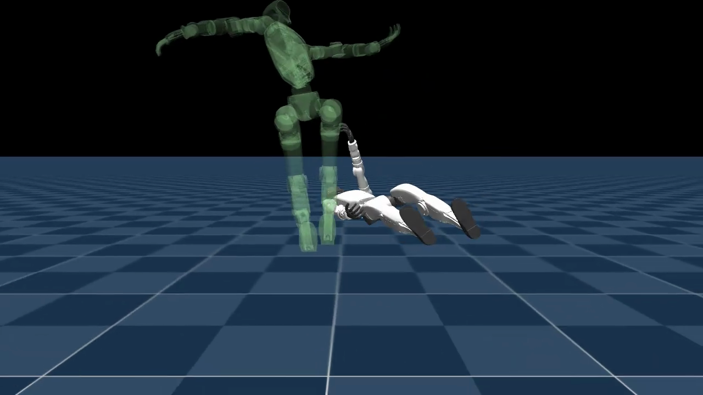
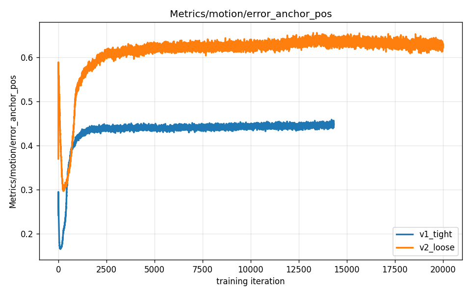
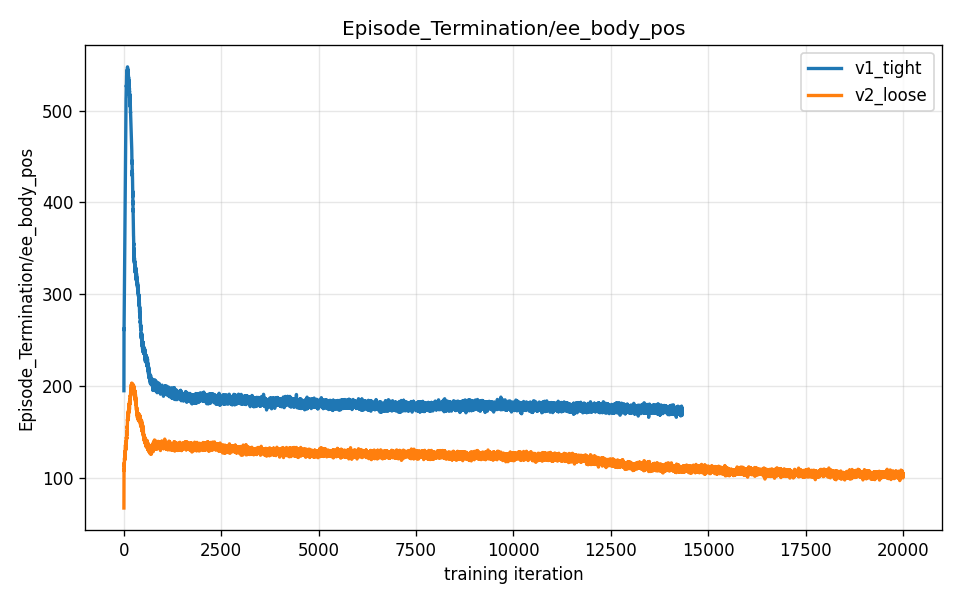
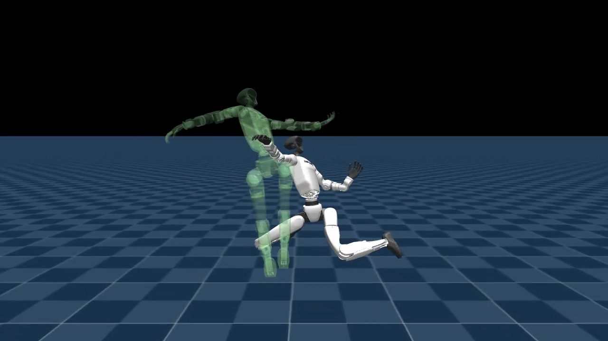

# Chapter 13 — The Backflip in Three Attempts

*Part V: A New Paradigm*

*This chapter assumes you have read chapters 01–12. In particular it builds on [Chapter 12](12-imitation-and-the-cartwheel.md)'s introduction of [motion imitation](12-imitation-and-the-cartwheel.md), [reference motion](12-imitation-and-the-cartwheel.md), the [tracking reward](12-imitation-and-the-cartwheel.md), and [termination threshold](12-imitation-and-the-cartwheel.md). It also relies on the [metric ≠ behavior](05-reading-the-training.md) caution from Chapter 05 and the vocabulary of [reward terms](06-watching-it-walk.md) and [reward weights](06-watching-it-walk.md) from Chapter 06. This chapter introduces two new concepts: **gated reward** — a reward term that is silent for most of an episode and only activates in the final phase — and **threshold diagnosis by metric** — using per-term plots to determine whether a termination threshold is too tight, rather than guessing visually.*

---

## What you are about to see

A backflip is harder than a cartwheel. Both are acrobatic inversions, but a cartwheel rotates sideways and keeps at least one limb near the ground at almost all times. A backflip launches the robot straight up, rotates it fully backward until it is completely upside-down, and then expects it to come down on its feet. That airborne, inverted phase is large, fast, and far from the ground — which turns out to matter enormously for how the termination threshold behaves.

Three training runs, each roughly eleven hours, got us there:

| Attempt | What changed | What happened |
|---|---|---|
| **v1** | cartwheel's proven thresholds (0.5 m / 0.8 rad) | winds up but **never leaves the ground** |
| **v2** | loosen thresholds to 1.0 m / 1.5 rad | **gets airborne, fully inverts — lands on its back** |
| **v3** | add a gated landing reward (`landing_feet_upright`, weight 5.0) | **full inversion, lands on its feet** |

Each attempt fixed exactly one thing. The arc from v1 to v3 is a worked example of the iterative, one-change-at-a-time discipline this curriculum has returned to again and again — applied now to a task where "just let it imitate the reference" is not sufficient on its own.

The reference itself was already on hand: a clean, single backflip motion retargeted onto the G1 (`smpl_backflip_to_g1.npz`, 88 frames at 50 fps ≈ 1.8 seconds). Starting from a verified single-flip reference removed the largest risk up front — the cartwheel campaign's worst time-sink was an accidental double-flip reference that asked the policy to do more than it could learn in one pass.

---

## Attempt v1 — thresholds too tight: it never leaves the ground

The first run carried over the cartwheel's proven termination thresholds: 0.5 m for `anchor_pos` (the distance from the robot's body center to where the reference says it should be) and 0.5 m for `ee_body_pos` (the same check on the end-effectors — hands, ankles) and 0.8 rad for `anchor_ori` (orientation difference).

Those thresholds worked for the cartwheel. They do not work for a backflip.

Here is why. A backflip goes much further from the starting pose than a cartwheel does. The moment the robot launches, its body travels upward — a meter or more above the floor, then fully inverted, head pointing down. At the peak of that arc, the robot's body is already far from the reference's idea of where it should be, even if it is tracking perfectly. The instant the body error crosses 0.5 m, the episode terminates.

The policy therefore experienced this every time it tried to jump: reward — reward — reward — cut. The episode ended before it could accumulate any signal for the airborne phase. It learned the only safe move: crouch and wind up (matching the first frames of the reference, which are near the ground) but never commit to the takeoff. The reference ghost can be seen flipping overhead; the white robot stays grounded beneath it.

<video controls autoplay loop muted playsinline preload="auto" width="100%" poster="assets/s2_v2_still.png">
  <source src="assets/s2_v1_grounded_side.mp4" type="video/mp4">
  Your browser doesn't support embedded video — <a href="assets/s2_v1_grounded_side.mp4">download the clip</a> instead.
</video>

The diagnosis from Chapter 12 applies here in its sharpest form: **a termination threshold that is too tight starves the policy of any experience of the hard phase, so it can never learn it.** The policy is not confused about what to do — it is being rationally punished for trying. Eleven hours of training produced a robot that had learned, precisely and reliably, to avoid attempting a backflip.

---

## Attempt v2 — loosen the thresholds: it gets airborne

The fix follows directly from the diagnosis. Give the episodes enough room to survive through the aerial phase. Position thresholds move from 0.5 m to **1.0 m**; orientation from 0.8 rad to **1.5 rad**. The orientation threshold needed to open up especially wide because a backflip involves a full backward rotation — even tiny timing offsets between the robot and the reference accumulate into large orientation errors during the fast inversion.

With these thresholds the robot now **launches off the ground and rotates backward through the air**:



<video controls autoplay loop muted playsinline preload="auto" width="100%" poster="assets/s2_v2_still.png">
  <source src="assets/s2_v2_attempt_side.mp4" type="video/mp4">
  Your browser doesn't support embedded video — <a href="assets/s2_v2_attempt_side.mp4">download the clip</a> instead.
</video>

<video controls autoplay loop muted playsinline preload="auto" width="100%" poster="assets/s2_v2_still.png">
  <source src="assets/s2_v2_attempt_chase.mp4" type="video/mp4">
  Your browser doesn't support embedded video — <a href="assets/s2_v2_attempt_chase.mp4">download the clip</a> instead.
</video>

A genuine airborne attempt. But it lands on its back.

### Reading the metrics to confirm the diagnosis

This is where **threshold diagnosis by metric** becomes useful — the practice of reading the per-term training plots to determine whether a threshold is having the intended effect, rather than guessing from the reward curve or the video alone.

Two plots tell the v1-vs-v2 story precisely:



The body-tracking error (how far the robot's body drifts from the reference on average) is *higher* in v2 (~0.63) than in v1 (~0.44). That is counterintuitive — shouldn't the policy that is attempting a flip have *worse* error? Yes, and that is the good news. v1's low error was not a sign of better tracking. It was the robot staying near the floor, close to the start of the reference, never venturing into the high-error aerial phase. v2's higher error means the policy is actually out in the air, where matching the reference is genuinely hard. **Higher anchor error here means more of the flip is being attempted**, not less skill.



The end-effector termination rate confirms it from the other direction. v2 (orange) terminates far less frequently than v1 (blue) — roughly 105 per rollout window versus 175, and still falling. v1's episodes were being cut at takeoff; v2's survive deeper into the motion and terminate less often as a result. The threshold change is doing exactly what it was supposed to do.

### Why v2 still lands on its back

The tracking reward is `exp(−(error²) / std²)` — it pays for matching the reference pose each frame. During the landing phase, the reference says the robot should be feet-down and upright. If the robot matches that, it gets full marks; if it lands on its back, it gets close-to-zero. So why doesn't the policy prefer feet-first?

The problem is that **a back-landing is almost as close to the reference as a feet-landing**, measured in total tracking error across the whole episode. The rotation and the aerial phase are the expensive frames — those are where the big errors accumulate. By the time the robot is coming down, the tracking reward has already collected most of its signal for the episode. A partial rotation that ends in a back-landing still earns most of those tracking marks. Nothing in the reward function specifically penalizes finishing upside-down or specifically rewards finishing on the feet.

The tracking reward is necessary — without it the robot would not flip at all — but it is not sufficient to specify *where it must land*. That needs its own explicit signal.

---

## Attempt v3 — add a landing reward: it lands on its feet

### The idea: a gated reward

The concept introduced here is a **gated reward**: a reward term that is zero for most of the episode and only activates in the final phase of the motion.

Think of it as a spotlight that turns on only during the landing window. During the takeoff and the aerial inversion, the spotlight is off — the only reward signal is the tracking reward, which is correctly telling the policy to match the reference's inverted mid-flip poses. Turning the landing reward on during those frames would create a contradiction: "be upright" conflicts directly with "be upside-down at the peak of the flip." A naive always-on landing reward would penalize the policy for the very inversion it needs to perform.

The gate solves this by restricting the landing reward to the last 40% of the reference clip — the phase where the robot should be coming back down and landing on its feet. In that window, "be upright with feet on the ground" is consistent with the reference, so the tracking reward and the landing reward pull in the same direction.

### The reward we wrote: `landing_feet_upright`

The landing reward is a new function, `landing_feet_upright`, that we added to the tracking task's reward module. The full source is in [`../../backflip-v3/landing_feet_upright.py`](../../backflip-v3/). Here is the shape:

```python
reward = gate * upright * feet_down   # all three in [0, 1]; product in [0, 1]
```

Three factors, each a number between 0 and 1, multiplied together. Every one of them must be high for the reward to be high — a single low factor drives the whole product toward zero.

**gate — the phase gate.** This is what makes the reward "gated." The reference clip has a total length; the gate tracks how far through that clip the current episode has progressed, as a number from 0 (start) to 1 (end). Below `phase_gate_start = 0.6`, the gate is exactly 0 — the landing reward contributes nothing. From 0.6 to 1.0 it ramps up linearly from 0 to 1. At the final frame it is fully on. That ramp (rather than a hard on/off step) gives the policy a gradient signal as it approaches the landing window — it can already "see" the reward starting to appear.

```
gate = clamp( (phase − 0.6) / 0.4,  0,  1 )
```

In words: how far past the 60% mark are we, as a fraction of the remaining 40%? Zero before that mark, one at the end, ramping linearly in between.

**upright — is the torso vertical?** The simulator tracks the direction gravity is pulling relative to the robot's body frame. When the robot is standing normally, gravity points straight down through the torso — the z-component of the gravity vector in body coordinates is −1. When the robot is inverted, it flips to +1. This term is:

```
upright = clamp( −projected_gravity_b.z,  0,  1 )
```

Equal to 1 when the robot is perfectly upright, 0 when it is completely inverted, and anything in between for intermediate tilts. No contact sensors needed — just a single number already computed by the simulator every step.

**feet_down — are the feet near the ground?** This is a per-foot ramp on how high the foot is above the floor. Below 0.12 m (the `foot_height_target`), the foot counts as fully down (score 1). Above 0.27 m (`target + margin`), it is fully up (score 0). In between it ramps:

```
feet_down_per = clamp( (0.12 + 0.15 − foot_height) / 0.15,  0,  1 )
```

Averaged over the left and right ankle links. The tracking scene has no contact sensors (adding one would require changing shared infrastructure), so foot height is used as a proxy. The math is purely bounded clamps and averages — no divisions by learned quantities, no unbounded exponentials, so the term can never produce a `NaN` or infinity, and is safe to leave registered at weight 0.0 when not in use.

*You don't need to read code to follow this — the plain-language version above says it all. For the curious, here is the actual reward function we wrote:*

The full function:

```python
def landing_feet_upright(env, command_name, asset_cfg, ...):
    # Gate: ramp on reference-motion phase
    phase = command.time_steps / float(total)          # [B], 0 → 1 across clip
    gate  = clamp((phase − 0.6) / 0.4,  0,  1)        # [B], 0 until 60%, ramps to 1

    # Upright: 1 when torso vertical, 0 when inverted
    upright = clamp(−projected_gravity_b[:, 2],  0,  1)   # [B]

    # Feet down: average of per-foot height ramps
    feet_down = clamp((0.12 + 0.15 − foot_height) / 0.15, 0, 1).mean(dim=-1)  # [B]

    return gate * upright * feet_down
```

### Why it is cartwheel-safe

The term ships with a default weight of **0.0**. It is registered in the environment configuration but contributes nothing to training unless you override the weight on the command line. The cartwheel run, every other tracking run, any future tracking motion — all of them are completely unaffected. The backflip run enabled it with a single CLI argument:

```
--env.rewards.landing-feet-upright.weight 5.0
```

A weight of 5.0 was chosen to make a clean landing worth roughly the same as nailing the full-body pose match in the landing window — the landing reward is bounded in [0, 1], and the per-step pose terms have weight 1.0 each, so 5.0 gives the landing enough pull to matter without overwhelming the tracking signal that keeps the flip itself on track.

### The result



<video controls autoplay loop muted playsinline preload="auto" width="100%" poster="assets/s2_v3_landed_still.png">
  <source src="assets/s2_v3_landed_side.mp4" type="video/mp4">
  Your browser doesn't support embedded video — <a href="assets/s2_v3_landed_side.mp4">download the clip</a> instead.
</video>

<video controls autoplay loop muted playsinline preload="auto" width="100%" poster="assets/s2_v3_landed_still.png">
  <source src="assets/s2_v3_landed_chase.mp4" type="video/mp4">
  Your browser doesn't support embedded video — <a href="assets/s2_v3_landed_chase.mp4">download the clip</a> instead.
</video>

Takeoff. Full backward inversion — the robot goes upside-down. Rotation continues. Feet-first landing. The policy recovers to standing.

### The metrics confirm what the video shows

Two signals from the v3 training run, read together, give the cleanest possible confirmation that this is a real improvement and not a happy accident of one clip:

The **landing reward climbed and held**. This term only scores above zero when the robot is simultaneously in the landing window (gate > 0), upright (not on its back), and feet near the ground. A back-landing produces upright ≈ 0, driving the product to zero. A feet-landing with the robot still partially inverted produces feet_down ≈ 0. The term does not lie easily — you need to be genuinely landed to earn it. A rising and sustained landing reward means the policy learned to land on its feet.

The **anchor error dropped from ~0.63 to ~0.43**. This is the key confirmation. Recall from v2 that higher anchor error meant more of the flip was being attempted. v3's drop tells the opposite story: with the landing reward in place, the policy tracks the reference *more closely* all the way through — including the landing frames, which it had previously been abandoning in a back-fall. Better full-motion tracking *plus* a high landing reward is the signature of a flip that is completed and landed, not bailed.

---

## The honest verdict

**v3 lands the backflip.** Confirmed frame by frame from two angles — the only verdict that counts.

The honest nuance: the landing is a *recovering crouch*, not a crisp gymnast's stick. The robot comes down on its feet, absorbs the impact in a deep bend of the knees, and returns to upright. It is unmistakably a backflip — it launches, fully inverts in the air, and lands on its feet — but it is not competition-clean. A competition landing would have the knees barely bending and the arms finishing overhead. The v3 robot squats deep before recovering. That gap is real and is not being papered over.

The three-attempt arc in one table:

| Attempt | Change | Behavior |
|---|---|---|
| v1 | tight thresholds (0.5 m / 0.8 rad) | winds up, never leaves the ground |
| v2 | loose thresholds (1.0 m / 1.5 rad) | airborne and rotating, lands on its back |
| v3 | + landing reward (weight 5.0, gated to last 40%) | **full inversion, lands on its feet** |

---

> **Insight: gated rewards let one policy handle contradictory phases**
>
> A backflip requires the robot to be fully inverted in the middle and fully upright at the end. Those are contradictory states. A reward term that runs throughout the episode must somehow be satisfied by both — which is usually impossible without the two phases pulling the policy in opposite directions.
>
> The gate resolves the contradiction by making the reward *phase-aware*. During the inversion, the landing reward is off; the tracking reward correctly signals "be upside-down now." In the landing window, the landing reward turns on; both it and the tracking reward now agree: "be right-side-up on your feet." No contradiction.
>
> This is the general principle: when a motion has phases with incompatible objectives, you do not need a single reward that magically handles all of them. You can write separate rewards gated to the phases where they apply. The policy sees a consistent signal throughout the episode, because each phase activates only the rewards that make sense for it.

---

## What you now understand

- **Termination thresholds for acrobatics must be calibrated to the motion, not borrowed from a different motion.** The cartwheel's 0.5 m threshold was not wrong for the cartwheel — it was wrong for the backflip's much larger aerial excursion. The same setting, applied to a harder motion, starved the policy of any aerial experience.

- **Threshold diagnosis by metric** means reading per-term plots — anchor error, termination rate — to distinguish "low error because the robot is good" from "low error because the robot never attempts the hard phase." A counterintuitively high error (v2 vs v1) can be the sign of genuine progress, not regression.

- A **gated reward** is a reward term with a phase gate: its weight is effectively zero for the early part of the episode and only activates in the final phase (here, the last 40% of the reference clip). This lets the designer add an explicit signal for the landing without fighting the inverted mid-flip, because the two objectives apply to different time windows.

- The `landing_feet_upright` term multiplies three factors — gate × upright × feet_down — all in [0, 1]. Every factor must be high for the reward to register. This is a useful pattern for rewards that should only fire in a conjunction of conditions.

- **"Match the reference" is necessary but not sufficient** for acrobatic landings. The tracking reward tells the policy *how* to flip but does not tell it *where to end*. An explicit landing reward closes that gap.

- The v3 landing is honest: a recovering crouch, not a gymnast's stick. The backflip is real and confirmed; the landing quality is a known remaining gap that further reward shaping could address.

Next: [Chapter 14 — Building Get-Up from Scratch](14-building-get-up-from-scratch.md). The backflip had a reference motion to imitate and needed its thresholds and landing reward tuned. The get-up task starts from an opposite problem: the robot begins genuinely fallen, and there is no reference motion. Chapter 14 shows what happens when you design a task completely from scratch — choosing the starting states, writing every reward term yourself — and documents the four distinct iterations it took to go from "lies on the floor" to "stands up reliably."

---

*Unitree G1, flat terrain, MuJoCo-Warp on a DGX Spark. Task: `Mjlab-Tracking-Flat-Unitree-G1`. Reference: `smpl_backflip_to_g1.npz`, 88 frames at 50 fps (≈ 1.8 s). 4096 parallel environments, 20 000 iterations per attempt (~11 hours each). v1→v2: termination thresholds 0.5 m / 0.8 rad → 1.0 m / 1.5 rad. v3: + `landing_feet_upright` reward, weight 5.0, gated to last 40% of clip. Full landing reward code and config edits: [`../../backflip-v3/`](../../backflip-v3/).*
