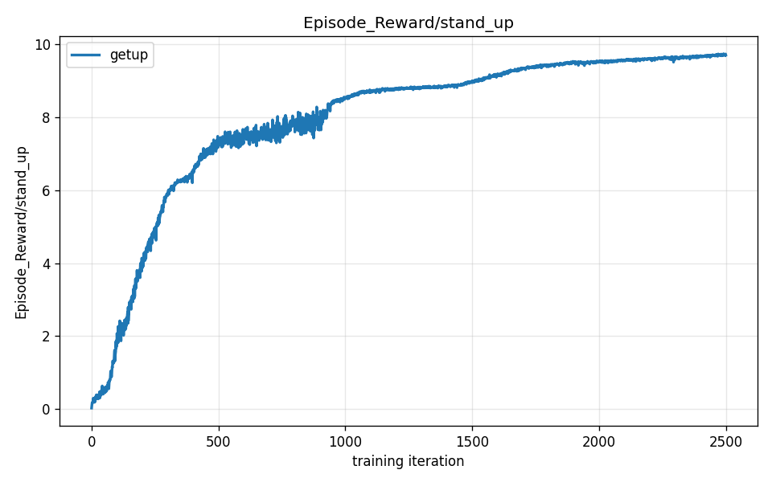
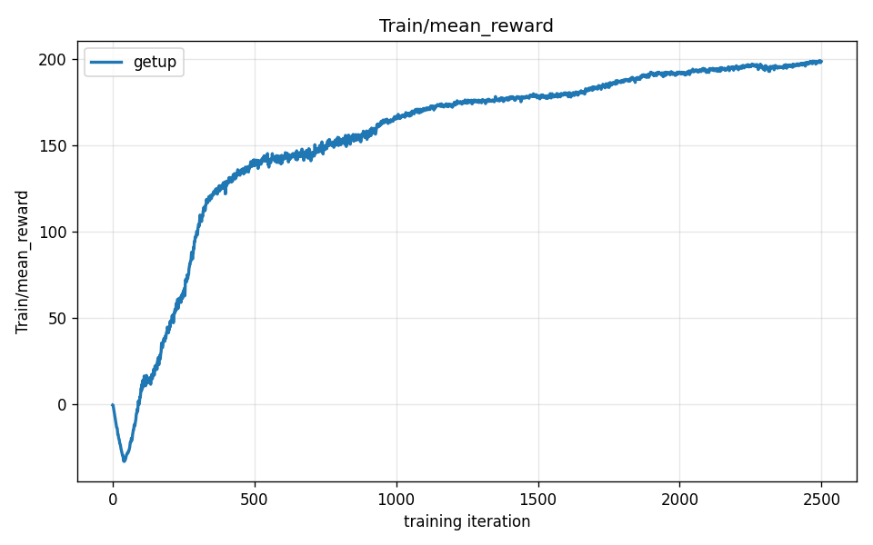
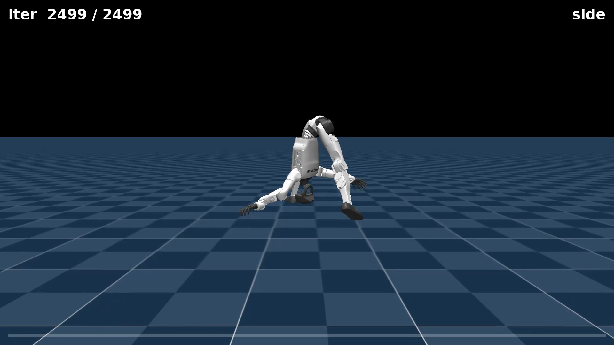

# Chapter 14 — Building Get-Up from Scratch

*Part V: A New Paradigm*

*This chapter assumes you have read chapters 01–13. It builds on the concepts of [reward terms and weights](06-watching-it-walk.md) (Chapter 06), [termination](07-proving-its-real.md) (Chapter 07), [reward hacking](09-the-running-dive.md) (Chapter 09), [metric ≠ behavior](05-reading-the-training.md) (Chapter 05), and [gated reward](13-the-backflip-in-three-attempts.md) (Chapter 13). This chapter introduces three new concepts: **initial-state distribution** — the set of starting states the robot is placed in at the beginning of each episode; **reward shaping iteration** — one complete cycle of designing, training, inspecting, and fixing the reward; and the **success-termination pitfall** — the failure mode where ending an episode on success accidentally removes the reward for maintaining success.*

---

## What makes this the hardest paradigm

Look at every skill this robot has learned so far:

- Chapters 06–11: the robot **starts standing** and is rewarded for following a velocity command. A "fallen" episode is already over — the termination cuts it short.
- Chapters 12–13: the robot **starts standing** and is rewarded for matching a reference motion frame by frame. The reference motion is the guide rail.

Both paradigms have something to lean on beyond the reward itself. The velocity task has a guide in the form of a command to follow. The imitation task has a guide in the form of a reference motion — a pre-recorded sequence of joint angles saying "at frame 1, your left knee should be here; at frame 2, like this..."

**Get-up has neither.**

The robot starts each episode lying on the floor. There is no command telling it where to go, because there is no velocity target — the goal is to stand, not to walk somewhere. There is no reference motion to imitate, because we do not have a motion-capture recording of a human lying on the floor in a robot-shaped body and pushing to standing (and even if we did, the retargeting pipeline from Chapter 12 struggles with poses that far from neutral). The only guidance is a reward function that you write from scratch, and the only way to know if it works is to run training, watch what the optimizer does with it, and fix what it gets wrong.

That is why this chapter documents four attempts rather than one.

---

## First: build the task — a new piece of code

Every other task in this curriculum used an existing mjlab task family and tuned its config. Get-up required **new code** before any training could happen, because no stock mjlab task puts the robot on the ground at the start.

The new task is `Mjlab-Recovery-Flat-Unitree-G1`. It was built by cloning the flat velocity config (`unitree_g1_flat_env_cfg`) and changing four things:

1. The starting state. A custom reset function drops the robot into one of four genuinely-fallen poses.
2. The fall termination is removed. The robot *starts* fallen — a "you fell over" rule would end every episode at step 1.
3. The velocity command is zeroed. There is no locomotion target.
4. The reward is rebuilt from the ground up to incentivize rising rather than walking.

The full task source lives in [`../../recovery-task/`](../../recovery-task/). The rest of this section walks through the two novel pieces: the reset and the reward.

---

## The initial-state distribution

**Initial-state distribution** is the set of starting states the robot can be placed in at the beginning of an episode. For the walking task (chapters 06–11), the initial-state distribution is simple: the robot starts in a standing pose, joints at nominal angles. For the backflip (Chapter 13), it starts from the same standing pose. The initial-state distribution is not something you usually have to think about — it is the same upright keyframe every time.

For get-up, the initial-state distribution *is* the task. If the robot starts standing, there is nothing to learn. If the robot starts in exactly one fixed fallen pose, the policy can memorize that specific recovery and fail on any other fall. The initial-state distribution needs to cover **genuinely fallen configurations**, and it needs to cover enough of them that the policy learns a robust strategy rather than a one-pose trick.

The reset function we wrote samples from four fallen orientations — supine (on its back), face-down (prone), left side, right side — and applies a random yaw heading on top:

```python
# Four genuinely-fallen orientations, chosen uniformly at random per env.
# Index: 0=supine, 1=face-down, 2=left-side, 3=right-side.
pose_idx = torch.randint(0, 4, (n,), device=env.device)

roll_values = torch.tensor(
  [math.pi, 0.0, math.pi / 2, -math.pi / 2], device=env.device
)
pitch_values = torch.tensor([0.0, math.pi / 2, 0.0, 0.0], device=env.device)
```

The pelvis is placed 0.08–0.15 m above the floor — enough clearance for the body to rest on its side without clipping — and all velocities are zeroed. Full code: [`../../recovery-task/mdp/events.py`](../../recovery-task/mdp/events.py).

### The zero-action probe

Before writing a single reward term, there is one question that must be answered: **is the task actually non-trivial?**

A zero-action probe runs the reset function but outputs *nothing* from the policy — every joint holds its neutral torque. If a robot with zero action naturally returns to standing, the task has been accidentally made trivial: any policy, even a random one, will appear to "learn" standing, because the physics engine would do it for free.

The lying-down reset passes the probe: a robot placed on its back or face-down with zero action **stays down**. The physics settle it flat against the floor. It does not pop back up. This is the confirmation that the task is real — the robot cannot stand unless the policy actively lifts it.

The first build of the reset had a bug: half the "fallen" robots actually spawned *upright but low* (the pelvis height threshold was wrong) and trivially stood up under zero action. The probe caught it. The reset was fixed so all four poses are genuinely on the ground before any training ran.

> **Insight: initial-state distribution and success definition are as load-bearing as the reward**
>
> In a from-scratch task — no command, no reference — the reward function is the only thing telling the policy what to do. Most practitioners know that a poorly designed reward leads to reward hacking. What is less obvious is that a poorly designed *starting state* does too. A robot that can reach its goal under zero action has found the ultimate hack: do nothing. It will score full reward without learning anything.
>
> The initial-state distribution and the definition of success (what counts as "done"?) must be designed with the same care as the reward terms. A bad reset is a reward hack waiting to happen — not because the reward is wrong, but because the task setup makes success trivially reachable.

---

## The four-iteration reward-shaping journey

**Reward shaping iteration** is one complete cycle of: design a reward, train to convergence, inspect the resulting behavior (on video, not on the number alone), identify the gap between what the reward measured and what you intended, and fix it. Chapters 12 and 13 involved iterative tuning too, but there the tracking reward provided a reference rail and the iterations were about thresholds and gating. Here, *every* reward term comes from scratch — which is why four full iterations were needed.

Each attempt below uses the same `Mjlab-Recovery-Flat-Unitree-G1` task with a different reward specification. The policy is PPO trained on 2048 parallel environments for up to 2500 iterations (~20 hours). The reward config changes are in [`../../recovery-task/config/g1/env_cfgs.py`](../../recovery-task/config/g1/env_cfgs.py).

---

### Attempt 1 — the stillness hack

**What changed:** the first reward kept several terms from the velocity walking task — `track_linear_velocity` and `track_angular_velocity` — with the command pinned to zero. The intent was "once you're up, hold still." On top of that, an upright term and a Gaussian height bonus (narrow peak near standing height).

**What happened:** the reward curve climbed to ~62, looking healthy. But the success rate peaked early (~33%) and then *decayed toward zero*. The video showed the robot lying perfectly flat on the ground and not moving.

Here is why. The velocity-tracking rewards score how well the robot matches its commanded velocity. The command is zero — so a robot with zero velocity gets a perfect score on those terms. A robot lying still has close to zero velocity. Therefore **a motionless fallen robot earns near-maximum reward on the velocity terms, every step, without doing anything**.

The Gaussian height bonus was too narrow: a Gaussian centered on the standing height (0.76 m) gives effectively zero signal at floor height (0.1 m). The gradient at the floor is nearly flat, so there is no incentive to even begin to rise. The stillness reward dominated.

The optimizer found this exploit and learned it perfectly. Why gamble on the risky, physically demanding business of getting upright when you can score high by doing nothing?

**The fix:** delete the velocity-tracking rewards. A fallen robot trivially satisfies a zero-velocity command. Also replace the Gaussian height bonus with a monotonic ramp (defined below) that has nonzero gradient everywhere from the floor to the standing target.

---

### Attempt 2 — the success-termination pitfall

**What changed:** velocity rewards removed. Monotonic height ramp added. Success termination added: when the robot's pelvis crossed 0.7 m (the "stood up" threshold), the episode ended early as a success.

**What happened:** the success rate improved (~50%) but again *decayed*, and episodes ran at full length. The video showed something unexpected: the robot pushing up to roughly half-height — a wide, low squat, pelvis around 0.5 m — and staying there, step after step, for the whole 20-second episode.

This is the **success-termination pitfall**: ending the episode the moment the robot stands up *removes all future reward* from the episode. Consider what the optimizer is weighing. If the robot completes the stand at step 100, the episode ends — it collects the height reward for those 100 steps and nothing more. But the episode lasts 1000 steps. If instead the robot hovers at half-height for all 1000 steps, it collects mid-height reward for 1000 steps. The arithmetic favors the hover: 1000 × (medium reward) > 100 × (high reward) + 900 × 0.

The success termination was meant as a reward for completion. It became a punishment for completion — it cut off all the remaining reward. The optimizer correctly exploited this, learning the precise half-height that maximized episode-length × reward-per-step.

**The fix:** remove the success termination entirely. With only a timeout, the way to maximize reward is to get up *and stay up* for the full episode. Every step at full standing height earns the maximum reward, so now the optimizer wants to stand tall for as long as possible.

The `stood_up` function still exists in [`../../recovery-task/mdp/`](../../recovery-task/mdp/) but is kept for offline evaluation only — it is deliberately not wired as a termination:

```python
# v3: do NOT terminate on success. Ending the episode the moment the robot
# stands up *removes* all its remaining reward, so in v2 the policy learned to
# hover in a half-crouch (~0.5 m) and farm the height reward for the full
# episode rather than finish the stand (which would cut the episode short).
```

This comment is in the production config — it is there precisely so the next person who looks at the code does not "fix" it back in.

---

### Attempt 3 — the stable-crouch local optimum

**What changed:** success termination removed. Everything else as in Attempt 2.

**What happened:** genuine progress. The robot now recovers from all four fallen poses to a stable, upright position. The `upright` reward (which measures how vertical the torso is) climbed to ~0.95 — nearly perfect. But the pelvis height stalled at ~0.52 m, short of the ~0.76 m full-standing target.

<video controls autoplay loop muted playsinline preload="auto" width="100%" poster="assets/s3_getup_still.png">
  <source src="assets/s3_crouch_side.mp4" type="video/mp4">
  Your browser doesn't support embedded video — <a href="assets/s3_crouch_side.mp4">download the clip</a> instead.
</video>

That 0.52 m posture is a wide, deep squat — knees bent far, feet spread wide, torso vertical. It is a **local optimum**: a configuration that is better than everything nearby but not as good as the global target. It is stable because:

- The center of mass is low, making balance easy with very little ongoing effort.
- The base is wide, making falls unlikely.
- The upright term pays near-maximum because the torso is vertical.
- Rising the last 0.24 m to a full stand requires constant active joint torques to maintain balance — more effort for a modest increase in height reward.

The optimizer correctly chose the squat. It is not confused about the goal; it found a valid equilibrium where the cost of improvement (more effort, more instability) outweighs the benefit (a bit more height reward). This is a **local optimum** in the same sense that a marble settled in a shallow bowl is "stuck" — not because the marble can't move, but because moving means going uphill first.

**The fix:** tilt the trade-off by making the benefit of fully standing larger than the cost. Two simultaneous changes:
- Double the height reward weight: 5 → 10. The last 0.24 m from squat to stand becomes twice as valuable.
- Cut the action-rate penalty: −0.1 → −0.03. Holding active balance at full height is cheaper in reward terms.

---

### Attempt 4 — a full stand

It worked.

The height reward climbed steadily and held at **9.7 out of a maximum 10** (pelvis ≈ 0.74 m, target 0.76 m) — and, unlike every previous attempt, showed **no decay**:



The overall reward shows the shape you want from a hard problem genuinely being solved: an early dip into negative territory (the exploration phase, dominated by penalty terms while the robot flails), followed by a long climb to a high, stable plateau:



The robot now recovers from a fallen pose all the way to a full upright stand — and stays there for the remainder of the episode:

<video controls autoplay loop muted playsinline preload="auto" width="100%" poster="assets/s3_getup_still.png">
  <source src="assets/s3_getup_side.mp4" type="video/mp4">
  Your browser doesn't support embedded video — <a href="assets/s3_getup_side.mp4">download the clip</a> instead.
</video>

<video controls autoplay loop muted playsinline preload="auto" width="100%" poster="assets/s3_getup_still.png">
  <source src="assets/s3_getup_chase.mp4" type="video/mp4">
  Your browser doesn't support embedded video — <a href="assets/s3_getup_chase.mp4">download the clip</a> instead.
</video>



---

## The final reward code

The reward function that got there is a single, clean function — monotonic height ramp from 0 at the floor to 1 at the standing target. The key design choice is stated in the docstring:

```python
def stand_up_height_reward(
  env: ManagerBasedRlEnv,
  target_height: float,
  floor_height: float = 0.1,
  asset_cfg: SceneEntityCfg = _DEFAULT_ASSET_CFG,
) -> torch.Tensor:
  """Monotonic reward on the root height: a clamped linear ramp from the floor
  to the standing target.

  Returns 0 when the pelvis is on the ground (floor_height) and 1 when it
  reaches target_height (the standing keyframe height), with a non-zero
  gradient *everywhere* in between. This is the key fix over a narrow Gaussian,
  which is ~flat at zero while the robot is down and so gives no signal to begin
  rising — the policy then has no gradient telling it to get off the ground.
  """
  root_z = asset.data.root_link_pos_w[:, 2]
  progress = (root_z - floor_height) / (target_height - floor_height)
  return torch.clamp(progress, 0.0, 1.0)
```

In words: compute how far the pelvis has traveled from floor height to standing height, as a fraction. Clamp it to [0, 1] so nothing weird happens if the robot somehow goes underground or springs too high. That fraction is the reward. When the pelvis is on the floor (0.1 m), the reward is 0. At 0.43 m — halfway to standing — it is 0.5. At 0.76 m, it is 1.0.

The gradient is constant and nonzero all the way from the floor: at every height, there is a reason to go higher. This is what the Gaussian in Attempt 1 lacked.

Full reward source: [`../../recovery-task/mdp/rewards.py`](../../recovery-task/mdp/rewards.py).

The final weight configuration from the production config:

```python
# v4: cut the action-rate penalty so the active balancing needed to extend
# fully is cheap.
cfg.rewards["action_rate_l2"].weight = -0.03

# v4: weight 5 -> 10 so the last 0.24 m from crouch to full stand
# is clearly worth the effort.
cfg.rewards["stand_up"] = RewardTermCfg(
  func=stand_up_height_reward,
  weight=10.0,
  params={"target_height": 0.76, "floor_height": 0.1, ...},
)
```

And the final training run:

```bash
ssh spark "docker exec mjlab-dev bash -lc 'cd /workspace/mjlab && python -m mjlab.scripts.train \
  Mjlab-Recovery-Flat-Unitree-G1 \
  --env.scene.num-envs 2048 \
  --agent.max-iterations 2500 \
  --agent.run-name recovery-v4'"
```

---

## The four attempts in one table

| Attempt | Misspecification | What the robot did | Fix |
|---|---|---|---|
| 1 | zero-command velocity rewards pay for *stillness* | lay flat and did not move | removed velocity rewards; switched to monotonic height ramp |
| 2 | success termination cut off future reward | half-crouched to farm height reward for the full episode | removed the success termination |
| 3 | full standing too costly vs. its reward | settled in a stable deep squat at ~0.52 m | doubled height weight; cut action-rate penalty |
| 4 | — | **stands up from all four fallen poses and holds the stand** | — |

None of these failures were bugs in the learning algorithm. PPO found the highest-scoring behavior available under the reward as written — exactly as it was designed to. The failures were in the **specification**: what we measured was not what we meant. Each iteration closed one gap between the two.

---

> **Insight: initial-state distribution and success definition are as load-bearing as the reward**
>
> In a from-scratch task, you have three design levers — not one. The **initial-state distribution** determines whether the task is even non-trivial (a robot that can stand under zero action needs no policy). The **success definition** — in particular, whether you terminate on success and when — determines whether the optimizer's path to high reward is the path you intended. The **reward terms and weights** determine what behavior is discovered along that path.
>
> Get-up needed four iterations because all three levers were touched across the four attempts: Attempt 1 fixed the reward terms; Attempt 2 fixed the success definition (removing the termination); Attempt 3 and 4 re-tuned the reward weights to break a local optimum. All three mattered. A perfectly-written reward with a broken initial-state distribution, or a perfectly-designed initial state with a perverse success termination, both produce a policy that does the wrong thing.

---

## What you now understand

- **Initial-state distribution** is not a detail — it is half the task design. For get-up, starting from four genuinely-fallen poses (supine, prone, left side, right side) with random yaw heading forces the policy to learn a robust recovery rather than memorize one pose. Verifying the distribution with a zero-action probe — confirming the robot stays down without policy input — is the first sanity check before any training.

- **Reward shaping iteration** is the name for the empirical loop this chapter documented: design → train → watch → fix. Four iterations is not a sign that something went wrong. Four iterations *is* the method for a from-scratch task. The cartwheel (Chapter 12) iterated twice on threshold; the backflip (Chapter 13) iterated three times. Get-up, with no reference motion and no command rail, needed four.

- The **success-termination pitfall** is a specific, common failure mode: terminating the episode the moment the robot achieves its goal removes all the future reward for *staying at the goal*. The optimizer is then incentivized to reach the goal slowly, partially, or barely — farming the reward leading up to success rather than completing it. The fix is a timeout-only episode: the robot earns the maximum reward by achieving the goal *and sustaining it* for the full episode length.

- A **local optimum** in the reward landscape is a stable configuration the policy reaches that is better than everything in its immediate neighborhood but is not the global target. The deep squat in Attempt 3 was exactly this — stable, low-cost, and scoring well enough that rising the last 0.24 m was not worth the effort. Breaking a local optimum means changing the reward to make the cost-benefit calculation come out differently.

- **Monotonic gradient matters.** A height reward with a Gaussian shape is flat near the ground — when the robot is lying down, the gradient is near zero, and there is no signal telling it to begin rising. A linear ramp from floor to target has a nonzero gradient everywhere: at every height, there is a reason to go higher. The choice between these two shapes determined whether Attempt 1 worked at all.

Next: [Chapter 15 — Reward Engineering as Craft](15-reward-engineering-as-craft.md). Across fourteen chapters, this curriculum has documented one walking baseline, one running experiment, a reward-hacking gallery, two acrobatic skills via imitation, and one from-scratch recovery task. Chapter 15 steps back to synthesize what the whole arc means: that RL success in robotics depends first and foremost on the care with which the reward function is designed, iterated, and audited — not on algorithm choice, architecture, or compute.

---

*Unitree G1 on flat terrain, MuJoCo-Warp on a DGX Spark. Task: `Mjlab-Recovery-Flat-Unitree-G1` — a new task written for this spine policy. Four reward iterations, 2048 parallel environments, up to 2500 iterations per attempt. The task source (reset, reward, config) is in [`../../recovery-task/`](../../recovery-task/).*

---

Co-Authored-By: Claude Opus 4.8 (1M context) <noreply@anthropic.com>
Claude-Session: https://claude.ai/code/session_01D6dhn7JiNfx8tpFbitRmgN
