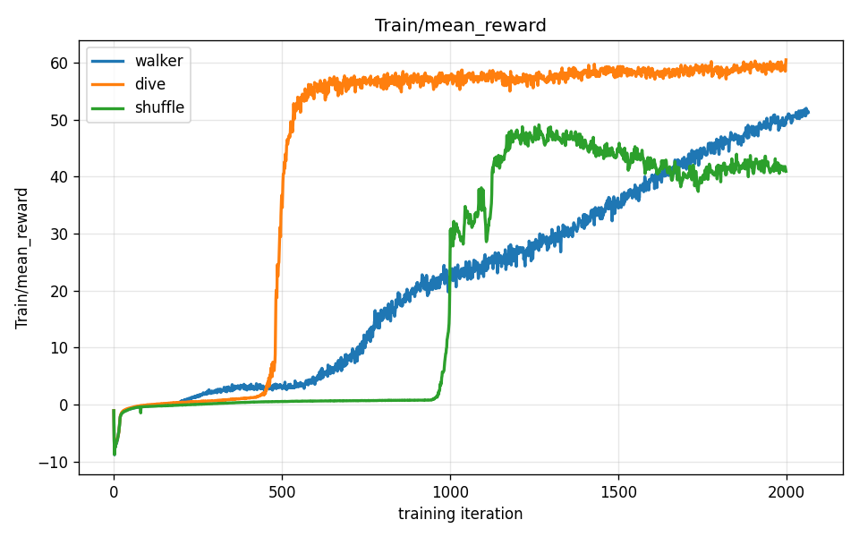
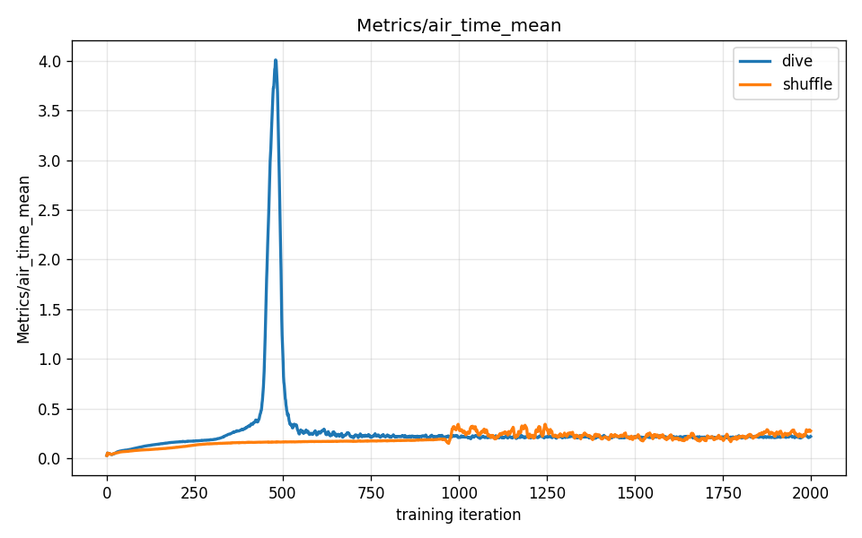

# Reward-Hacking Gallery: Three Ways a Reward Misled Us

*This report is the Reward Engineering track's capstone. The vocabulary — [policy](00-primer.md), [reward](00-primer.md), [episode](00-primer.md) — is defined in [00-primer.md](00-primer.md). Report [03](03-turning-the-knobs.md) introduced the idea that a higher reward number does not mean a better robot; the [running-and-flight report](running-and-flight.md) caught it happening live. This gallery steps back and organises what we found into a small **taxonomy of failure modes** — because they are not all the same kind of failure.*

---

## The central idea

A reinforcement-learning algorithm does exactly what you reward it to do. It does not understand what you *meant*. It finds the shortest path to the highest score.

When the reward measures a *proxy* for the behaviour you want — rather than the behaviour itself — the policy finds the proxy and exploits it. The score climbs, the curve trends up, the metrics look green. Then you render the video, and the robot is doing something completely different from what you intended. That is **reward hacking**, and it is not a bug in the algorithm: it is the algorithm working *correctly* on an *incorrectly specified* objective.

But "the reward misled us" turns out to have more than one flavour. This gallery collects three real specimens from this project's own training runs, and they fail in three genuinely different ways:

| # | Exhibit | Failure mode | How loud? |
|---|---|---|---|
| **1** | The air-time **dive** | **Proxy gaming** — the reward measured the wrong thing and got maximised the wrong way | **Loud** — high score, visibly broken |
| **2** | The **no-upright** run | **Silent compensation** — a removed term was quietly covered by another mechanism | **Quiet** — low score, looks fine, just under-performs |
| **3** | The cartwheel **scorer** | **Metric lying** — the *evaluation*, not the reward, measured a proxy | **Invisible** — the number says success, the video says no |

The video is the experiment. Every claim below is confirmed by watching the rendered clip — never by a score. That is the whole point of the gallery.

---

## Exhibit 1 — The dive: proxy gaming (a loud failure)

This is the centrepiece, and it is documented in full in the [running-and-flight report](running-and-flight.md) — here is the short version.

**Naive reward:** to get a running *flight phase* (both feet off the ground at once), reward the robot for **air time** — the fraction of time its feet spend off the floor. Weight `1.0`.

**Expected behaviour:** an upright run with a pronounced flight phase.

**Actual behaviour (the hack):** the robot throws itself forward and glides along nearly **horizontal, face-down**. A body in mid-dive has both feet off the ground *continuously* — which is precisely what "air time" rewards.

<video controls autoplay loop muted playsinline preload="auto" width="100%" poster="assets/s1_dive_still.png">
  <source src="assets/s1_dive_side.mp4" type="video/mp4">
  Your browser doesn't support embedded video — <a href="assets/s1_dive_side.mp4">download the clip</a> instead.
</video>

**The tell — highest score, worst robot.** Across three policies that differ *only* in the air-time weight, the diving one earns the **highest reward of all** (~60, versus ~51 for the ordinary walker), and it gets there fastest:



The air-time metric shows the exact moment the policy lunges onto the hack — a spike to ~4.0 around iteration 480, the instant its reward explodes:



**What it teaches:** `air_time` is a *proxy* for "runs with a flight phase," and the proxy had a cheaper solution (dive) than the real thing (run). The optimiser took the cheaper one — because that is what optimisers do.

**The fix:** reward the *outcome*, not a proxy for it. A flight phase is better specified as a *gait pattern* — feet alternating on a target rhythm while the torso stays upright — than as raw air time. Harder to write; much harder to hack.

---

## Exhibit 2 — The no-upright run: silent compensation (a quiet failure)

Not every reward mistake is loud. Some fail so quietly you might not notice.

**Naive reward:** the velocity task includes an `upright` reward (weight `1.0`) that pays the robot for keeping its torso vertical. Hypothesis: remove it (`weight 0.0`) and the robot should obviously fall over or lurch. Let's see the carnage.

**Expected behaviour:** a robot that abandons posture entirely — flopping, lurching, collapsing.

**Actual behaviour:** almost an anticlimax. With the upright reward gone, the robot still stands up, roughly vertical, and takes small cautious steps — it just barely moves toward its commanded speed:

<video controls autoplay loop muted playsinline preload="auto" width="100%" poster="assets/s4_noupright_still.png">
  <source src="assets/s4_noupright_side.mp4" type="video/mp4">
  Your browser doesn't support embedded video — <a href="assets/s4_noupright_side.mp4">download the clip</a> instead.
</video>

Its reward is very low (~2.9, against the walker's ~51) — but **not because it fell**. It is low because the robot *under-moves*: it never tracks the commanded speed. It looks fine and does almost nothing.

**What it teaches:** the `upright` term wasn't the only thing keeping the robot vertical. The episode also **terminates if the robot falls** — so falling is already punished, indirectly, by ending the stream of future reward. With `upright` removed, that termination *silently compensated*: posture was preserved by a different mechanism, and the visible symptom moved somewhere subtler (poor speed tracking) instead of the dramatic collapse we predicted. This is the dangerous kind of reward bug — the one that does not announce itself. You only catch it by noticing the *number is low* and asking *why*, then watching the video to see that "low reward" meant "timidly under-performing," not "crashed."

**The fix:** there is nothing to "fix" here so much as to *understand* — reward terms interact, and removing one rarely produces the clean, isolated effect you imagine. Always check what *else* in the system is enforcing the behaviour you think one term owns.

---

## Exhibit 3 — The cartwheel scorer: when the *metric* lies

The first two exhibits are about the **training reward**. This one is about the **evaluation metric** — and it is the most insidious, because it can fool you *after* training, when you think you're being careful.

This specimen comes from the cartwheel campaign documented in [cartwheel-journey.md](../cartwheel-journey.md) and the [imitation-cartwheel report](imitation-cartwheel.md). No new run was needed — it already happened.

**What `score_cartwheel.py` measures:** it reads per-episode telemetry and flags an episode as a "completed cartwheel" if the pelvis **roll angle** passes through roughly 150°+ (near-inversion) and the robot ends near upright. It is, in plain terms, a *roll-angle detector* — not a cartwheel detector.

**The hack the scorer missed:** during one cartwheel iteration, the scorer reported a **near-total completion rate (~95%)**. Frame-by-frame video review showed the robot was **face-planting** — running into the ground and tumbling — *not* cartwheeling. A crash-roll tumbles the pelvis through 180° just like a cartwheel does, and the next episode resets the robot upright. To a roll-angle detector, a face-plant crash and a clean cartwheel are *indistinguishable*. The scorer counted the crashes as successes.

**What it teaches:** a numerical metric is only valid when it genuinely tracks the behaviour you care about. "Higher score" means nothing if the scorer is measuring a proxy — exactly the same lesson as the training rewards above, now applied to **evaluation**. This is why, throughout this whole project, the rule is: **visual review is the primary gate.** A scorer is a first-pass filter that tells you *which clips to watch*, never a verdict on its own.

---

## The capstone lesson

None of these three are bugs, edge cases, or algorithm failures. In every case the system did *exactly* what it was told. The failure was in the *specification* — of the reward, or of the metric.

Pulling the three together gives a small but durable checklist for anyone designing rewards:

1. **Proxy gaming (the dive):** does my reward measure the *outcome I want*, or a stand-in that has a cheaper degenerate solution? If a stand-in, the optimiser will find the degenerate solution.
2. **Silent compensation (the no-upright run):** do my reward terms *interact*? Is the behaviour I attribute to one term actually being held up by another (a termination, a different penalty)? Removing or adding a term rarely has the clean isolated effect I picture.
3. **Metric lying (the cartwheel scorer):** is my *evaluation* measuring the real thing, or a proxy that a failure can sneak through? Never let a number be the final verdict — watch the video.

Practitioners spend more time iterating on the reward and the metric than on the algorithm. Each exhibit here *is* an iteration step: you wrote an objective, the system found a way you didn't anticipate, and that discovery sharpened your understanding of what the objective actually needed to say.

---

## Tweak this to explore

**Sweep the air-time weight yourself** — `0.0` (clean walker), `0.4` (a splay-legged shuffle), `1.0` (the full dive). Watch the gait degrade as the score *climbs*. This is the cleanest reproduction of Exhibit 1:

```bash
--env.rewards.air-time.weight=0.4   # try 0.0, 0.2, 0.4, 0.7, 1.0
```

**Probe silent compensation** — remove a different "safety" term (e.g. a foot-slip or self-collision penalty) and predict the carnage before you watch. Were you right, or did something else quietly cover for it? The gap between your prediction and the video *is* the lesson.

**Stress-test a metric** — take any scorer (including `score_cartwheel.py`) and deliberately feed it a known-bad policy. Does it correctly reject the failure, or does the failure slip through a proxy? A metric you have never tried to *fool* is a metric you should not trust.

**The richest hacks are still ahead** — the S3 get-up task (a from-scratch reward with no reference motion) is where reward hacking gets genuinely hard, because there is no demonstration to lean on. When that campaign runs, its hacks get documented in the [get-up report](getting-up.md) and cross-linked here.

---

*Exhibits 1–2 use the Unitree G1 velocity task on flat terrain; Exhibit 3 is from the tracking (cartwheel) task. All trained with the MuJoCo-Warp simulator on a DGX Spark (NVIDIA GB10, aarch64). Exhibit 1's three policies differ only in the `air_time` weight; Exhibit 2 removes the `upright` reward. The spec for this campaign: [2026-06-19-spine-reward-hacking-gallery.md](../superpowers/specs/2026-06-19-spine-reward-hacking-gallery.md).*
